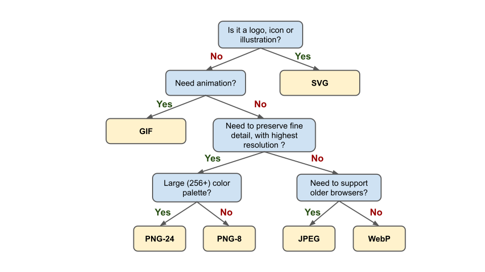
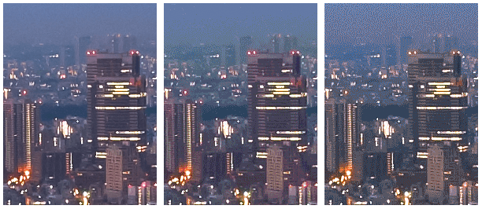

This lesson was based on the pages [**Image Optimization**](https://developers.google.com/web/fundamentals/performance/optimizing-content-efficiency/image-optimization) by developers.google.com, **[Responsive Images the Simple Way](https://cloudfour.com/thinks/responsive-images-the-simple-way/)** by CloudFour and 


# Optimization & Responsive Images


## Why optimize images ?

Page load times is directly related to [bounce rates](https://support.google.com/analytics/answer/1009409?hl=en) and  inversely proportional to sales conversion.

This means **Fast = $$$**

<br>

- [Every 100ms improvement brings Walmart up to 1% incremental revenue](https://www.slideshare.net/devonauerswald/walmart-pagespeedslide/46)

- [Cloudflare reports that going from 5.7s to 2.4s load time triples the conversion rate](https://www.cloudflare.com/learning/performance/more/website-performance-conversion-rates/)
- [Akamai reports that a two-second delay in web page load time increase bounce rates by 103%](https://www.akamai.com/uk/en/about/news/press/2017-press/akamai-releases-spring-2017-state-of-online-retail-performance-report.jsp)

<br>

**How do we lower page load time?**

Let's look at what we are loading:

<br>


<p align="center"><a href="https://httparchive.org/reports/page-weight?view=grid"><em>HTTP Archive - Page Weight Report</em></a></p>
<br>

Most of the data moved over the Internet are videos.

However:

- Videos are typically not downloaded at initial load time;
- Most pages don't serve videos (every 2 out of 76 resource requests are videos);


The next largest asset type slowing down load times are images.

<br>

**In order to reduce image load times we will focus on the following approaches:**


1. **Choosing the right image format;**
2. **Optimize compression;**
3. **Use responsive images;**
4. **Lazy-load images;**


<br>

> Image optimization is both an art and science: an art because there is  no one definitive answer for how best to compress an image,  and a science because there are many techniques that can significantly reduce the size of an image. 
>
>  -  Ilya Grigorik , web performance engineer at Google


# Choosing the image format

There are five widely used image formats for the web:

<br>

|                          **Format**                          | **Type** | **Transparency** | **Animation** | **Lossy** | **Lossless** |
| :----------------------------------------------------------: | :------: | :--------------: | :-----------: | :-------: | :----------: |
| [GIF](http://en.wikipedia.org/wiki/Graphics_Interchange_Format) |  Raster  |       Yes        |      Yes      |    No     |     Yes      |
| [PNG](http://en.wikipedia.org/wiki/Portable_Network_Graphics) |  Raster  |       Yes        |      No       |    No     |     Yes      |
|          [JPEG](http://en.wikipedia.org/wiki/JPEG)           |  Raster  |        No        |      No       |    Yes    |     No*      |
|          [WebP](http://en.wikipedia.org/wiki/WebP)           |  Raster  |       Yes        |      Yes      |    Yes    |     Yes      |
|   [SVG](https://developer.mozilla.org/en-US/docs/Web/SVG)    |  Vector  |       Yes        |      Yes      |    No     |     Yes      |

*Is part of the jpeg standard but rarely supported by programs and browsers.

<br>

While there is no definite answer, below is a recommendation based on a few basic questions:

<br>



<p align="center"><a href="https://developers.google.com/web/fundamentals/performance/optimizing-content-efficiency/image-optimization#eliminating_and_replacing_images"><em>Adapted from "Image Optimization" by developers.google.com</em></a></p>
<br>

## Vector vs. Raster images

If the image type permits, SVG's should be preferred as they are resolution independent, typically smaller and always deliver sharp results.

Raster images should be used for complex scenes with lots of irregular shapes and details

<br>

Note that **SVG images can also be optimized via lossless compression** (see more below).

<br>

The .svg image below has 3.7 kB in size while the .png equivalent has 9.5 kB. Thats 2.5x smaller.

<br>


<p align="center"><a href="https://www.flaticon.com/authors/eucalyp" title="Eucalyp"><em>Eucalyp</a> from <a href="https://www.flaticon.com/" title="Flaticon"> www.flaticon.com</em></a></p>
# Optimizing Compression

Image compressors use a variety of techniques to reduce the number of required bits per pixel to reduce file size of the image.

<br>

There are two types of compression:

- Lossy
- Lossless

<br>

Image optimization is typically a function of lossy **and** lossless compression. 

Differences in image formats are largely due to how compatible they are to lossy and lossless algorithms.

<br>

## Lossy

Some **information is lost** during compression. Image after compression is of lower definition. This process is irreversible.

When done properly, the loss in quality is barely noticeable. 

<br>

Lossy compression algorithms reduce image size by:

- Simplifying or reducing the number of pixels;
- Reducing the number of colors.

<br>


<p align="center"><a href="https://technofaq.org/posts/2018/02/pitfalls-to-avoid-when-choosing-images-for-your-webpage/"><em>Image by technofaq.org</em></a></p>
<br>

For example, in the animation below, pixels are merged to progressively simplify the image:

<br>


<br>

In the image below, the same picture is exported using different color palettes (colors available to "paint" the image). From left to right (PNG): 32-bit (4 channels, 16M colors), 7-bit (128 colors), 5-bit (32 colors).

<br>



<p align="center"><a href="https://developers.google.com/web/fundamentals/performance/optimizing-content-efficiency/image-optimization#eliminating_and_replacing_images"><em>Image Optimisation - developers.google.com</em></a></p>
<br>

## Lossless

No **information is lost** during compression. Image before and after compression are **identical**. Lossless compression shrinks images by replacing and substituting patterns in bits of pixel data.


This is done similarly to how .zip files are compressed. This process is perfectly reversible.


For example, in the image below (pixels are laid out as a  pixel array), patterns are simplified by listing the repetitions:


<p align="center"><a href="https://technofaq.org/posts/2018/02/pitfalls-to-avoid-when-choosing-images-for-your-webpage/"><em>Image by technofaq.org</em></a></p>
<br>

## Compression Tools

From a practical perspective, the compression type and quality levels are chosen when the image is created or using conversion software.


Some online services offer the ability to optimize and further compress images:


- [TinyPNG](https://tinypng.com/) and [TinyJPG](https://tinyjpg.com/)
- [CompressPNG](https://compresspng.com/) and [CompressJPEG](https://compressjpeg.com/)
- [SVGOMG](https://jakearchibald.github.io/svgomg/)


<br>

> Always optimize compression before adding images to your production website!

  

# Responsive images

The simplest and most effective image optimization techniques is to  ensure that we are not sending any more pixels than necessary in order to display an asset in the browser.


Many front-end developers ship larger assets than necessary and rely on CSS for rescaling - which requires extra bandwidth and extra CPU resources.

<br>

In the example below, we are forcing mobile and tablet users to download two 1200x800px images, and then asking the browser to reduce their size.

<iframe height="487" style="width: 100%;" scrolling="no" title="wk10-srcset-ex1" src="https://codepen.io/maujac/embed/abvBvdB?height=487&theme-id=light&default-tab=html,result" frameborder="no" allowtransparency="true" allowfullscreen="true" loading="lazy">
  See the Pen <a href='https://codepen.io/maujac/pen/abvBvdB'>wk10-srcset-ex1</a> by Mauricio Buschinelli
  (<a href='https://codepen.io/maujac'>@maujac</a>) on <a href='https://codepen.io'>CodePen</a>.
</iframe>


<br>

We will learn how to make these images responsive.

<br>

**There are two approaches in native HTML to ensure the right image size is used for the right viewport width:**

-  `srcset` attribute - for serving different sizes of the same image.
- `<picture>` element - for serving a different image altogether at a new layout configuration.

<br>


# Retina Screens & CSS Pixels

Retina screens have two to three times more pixels than a traditional screens. This is referred to as a **Display Pixel Ratio** (DPR) of 2x or 3x.


When talking about DPR, we need to make the distinction between CSS pixels (also called logical resolution) and hardware pixels (also known as physical resolution).


All the pixel dimensions declared via styling are CSS pixels.

```css
img { width: 200px; }
```


<br>

Traditionally one CSS pixel mapped to one hardware pixel, however, that is not the case with higher DPR devices. 


If you are curious:

**CSS Pixel = (hardware pixel) / DPR**

<br>


<p align="center"><a href="https://www.internetingishard.com/html-and-css/responsive-images/"><em>Standart vs Retina Resolution by Interneting is Hard</em></a></p>
<br>

This means that a container of size 400x200 CSS pixels will be display at 200x100 hardware pixels in a retina display of 2x.

<br>

We can interpret this from two different angles:

- For an image of standard resolution to take the same amount of space in a retina display it needs to be 2x or 3x as big;
- An image will look 2x or 3x smaller in a retina display compared to a standard display.

<br>


<br>

# `srcset` attribute

You can use the `srcset` attribute in order to serve a different sized copy of the same image depending on the user’s viewport width (also called resolution switching).

<br>


> This is particularly useful because it detects hardware pixels and lets the browser choose the appropriate image to download.
>
> In other words, **it works for displays with higher DPR and standard screens**.

<br>


<p align="center"><a href="https://www.internetingishard.com/html-and-css/responsive-images/"><em>The srcset attribute by Interneting is Hard</em></a></p>
<br>

## `srcset` syntax

The `srcset` attribute is used within the `` tag in order to give the browser multiple download options.


It must always include a fallback image in the regular `src` attribute in case the browser does not support the `srcset` attribute.

<br>

```html
" src="<fallback image>" 
     srcset="<path to small-image> <small width>w,
             <path to medium-image> <medium width>w,
             <path to large-image> <large width>w ">
```

*Multiple line breaks were used within the same opening `` tag to facilitate readability. Everything could have been declared in the same line.

<br> `srcset` is a comma-separated list of URLs paired with the actual widths of the images.

<br>

>  The width of the image must be included along with the **w** unit. This **w** unit is in pixels and is unique to the syntax of `srcset`.

<br> 


<p align="center"><a href="https://cloudfour.com/thinks/responsive-images-the-simple-way/"><em>The srcset attribute by CloudFour</em></a></p>
<br>

We will convert the images from the first example into responsive images with the `srcset` attribute:


```html

```

<iframe height="431" style="width: 100%;" scrolling="no" title="wk10-srcset-ex2" src="https://codepen.io/maujac/embed/qBOqZob?height=431&theme-id=light&default-tab=html,result" frameborder="no" allowtransparency="true" allowfullscreen="true" loading="lazy">
  See the Pen <a href='https://codepen.io/maujac/pen/qBOqZob'>wk10-srcset-ex2</a> by Mauricio Buschinelli
  (<a href='https://codepen.io/maujac'>@maujac</a>) on <a href='https://codepen.io'>CodePen</a>.
</iframe>


<br>

In order to observe `srcset` working:

1. Open the Dev Tools, open the "Networking" tab

   

2. Refresh the page

3. Highlight the image to see the size of the downloaded asset

   


<br>

## Art Direction and the `<picture>` element


The `<picture>` element is another HTML method that gives us the ability to download different assets depending on viewport widths.


>  Unlike the `srcset` attribute, the `<picture>` element is used to completely change the type of image being served.


<br>

**Below is an example:**

```html
 <picture>
  <source media="(min-width: 650px)" srcset="img_food.jpg">
  <source media="(min-width: 465px)" srcset="img_car.jpg">
  
</picture> 
```


<br>

Notice the following:

- The `<picture>` element uses a nested `<source>` element, in the same way that the `<audio>` and `<video>` elements.

- Each `<source>`  element includes a different asset source and **optionally a media query that defines when to use it.**
- A fallback image must always be included.


<br>

The `<picture>` element is normally used to completely change images in favor of a new image that best fits the new screen layout.

**This is known as art direction and is mostly a visual design choice.**

<br>


<br>

[**Here is an example**](https://cloudfour.com/examples/img-currentsrc/) from CloudFour and inspired by Google Chrome Team


<p align="center"><a href="https://cloudfour.com/examples/img-currentsrc/"><em>Art Direction by CloudFour</em></a></p>

<br>

> **We will not use the `<picture>` element in this course.**
>
> For now focus on the `srcset` attribute in order to serve responsive images.


<br>

If you would like to learn more about the `<picture>` element, see the [HTML Picture Element page by W3C Schools](https://www.w3schools.com/htmL/html_images_picture.asp)

<br>

## Image Resizing Tools

If you would like to serve smaller versions of an image but only have access to the large sized version, you can use the online tools below to export smaller versions:

- [PicResize.com](https://picresize.com/)
- [ResizeImage.net](https://resizeimage.net/)
- [ImageResizer.com](https://imageresizer.com/)


<br>

# References & Diving Deeper

Recommended readings:


 - [**Image Optimization**](https://developers.google.com/web/fundamentals/performance/optimizing-content-efficiency/image-optimization) by developers.google.com on Web Fundamentals

 - [**Responsive Images**](https://www.internetingishard.com/html-and-css/responsive-images/) by Interneting is Hard

 - **[Responsive Images the Simple Way](https://cloudfour.com/thinks/responsive-images-the-simple-way/)** by CloudFour

   

 Recommended video:

<iframe width="560" height="315" src="https://www.youtube.com/embed/2QYpkrX2N48" frameborder="0" allow="accelerometer; autoplay; encrypted-media; gyroscope; picture-in-picture" allowfullscreen></iframe>
<br>