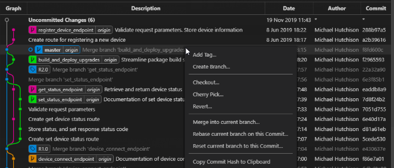
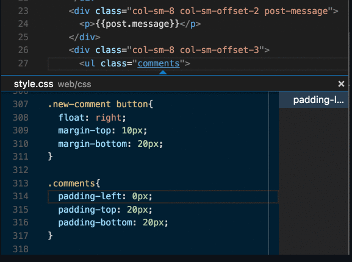

# JS Tooling & Extras

There are many tools that can make developing easier and more pleasant. However, learning how to use and setting up tooling can be just as complex as the program we are trying to write.

In this section we will look at some tools that are easy to use but can make a big impact in the developer experience:

- Dev Tool's debugger
- VS Code Plugins

 

## Debugger in the Dev Tools

Both Firefox and Chrome come with a build in debugger that **runs on top of the downloaded html , css and JavaScript files**.

### Firefox

Select the ***Debugger Tab*** at the top of the Dev Tools

 

 

**Left panel:** your project files (as downloaded by the browser).

**Middle panel:** The JavaScript code.

**Right panel:** 

- Variables and their values inside a given scope.
- The call stack (who called who).
- Breakpoints you have added.

 

#### Firefox Resources:

[**The Firefox JavaScript Debugger**](https://developer.mozilla.org/en-US/docs/Tools/Debugger) by MDN Web Docs

 

<iframe width="560" height="315" src="https://www.youtube.com/embed/bwUNifZ4WrY" title="YouTube video player" frameborder="0" allow="accelerometer; autoplay; clipboard-write; encrypted-media; gyroscope; picture-in-picture" allowfullscreen></iframe>

 

### Chrome

Look for the ***Sources Tab*** at the top of the Dev Tools.

 

 

**Left panel - File Navigator** pane lists HTML, JavaScript, CSS and other files, including images that are attached to the page. Chrome  extensions may appear here too.

**Middle panel - Code Editor** pane shows the source code.

**Right panel - JavaScript Debugging pane**

- Variables and their values inside a given scope.
- The call stack (who called who).
- Breakpoints you have added.

#### Chrome Resources

[**Debugging in Chrome**](https://javascript.info/debugging-chrome) by JavaScript.info

 

<iframe width="560" height="315" src="https://www.youtube.com/embed/H0XScE08hy8" title="YouTube video player" frameborder="0" allow="accelerometer; autoplay; clipboard-write; encrypted-media; gyroscope; picture-in-picture" allowfullscreen></iframe>

 

## VS Code Plugins

There are thousands of VS Code plugins. The choice of which plugins to install largely depends on taste and personal workflow.

Here are some popular plugins that are worth a try:

### Prettier - Code formatter

 

> [Prettier](https://prettier.io/) is an opinionated code formatter. It enforces a consistent style by parsing your code and re-printing it with its own rules that take the maximum line length into account, wrapping code when necessary.

 

Prettier will format your code every time you save in order to follow some formatting rules.

**Works for many languages, including HTML, CSS, and JavaScript**

For example:

- Add tabs so that code blocks follow correct indentation;
- Add spaces inside expressions in order to make code more legible

 

### Bracket Pair Colorizer 2

 

> This extension allows matching brackets to be identified with colours. The user can define which tokens to match, and which colours to use.

 

Helps you find opening and closing bracket pairs:

 

### Git Graph

 

>View a Git Graph of your repository, and easily perform Git actions from the graph. Configurable to look the way you want!

 

Visualize you git branches and commits

 

### CSS Peek

 

> Allow peeking to css ID and class strings as definitions from html files to respective CSS. Allows peek and goto definition

 

Helps you bridge between your HTML and CSS sheet and quickly understand which CSS selectors and rules are affecting a given HTML element.

 

### Other honorable mentions

 **[Code Spell Checker](https://marketplace.visualstudio.com/items?itemName=streetsidesoftware.code-spell-checker)**

- A basic spell checker that works well with camelCase code.

[**Auto Rename Tag**](https://marketplace.visualstudio.com/items?itemName=formulahendry.auto-rename-tag)

- Automatically rename paired HTML/XML tag, same as Visual Studio IDE does.

[**GitLens**](https://marketplace.visualstudio.com/items?itemName=eamodio.gitlens)

- Visualize code authorship at a glance via Git blame annotations and code  lens, seamlessly navigate and explore Git repositories, gain valuable  insights via powerful comparison commands, and so much more