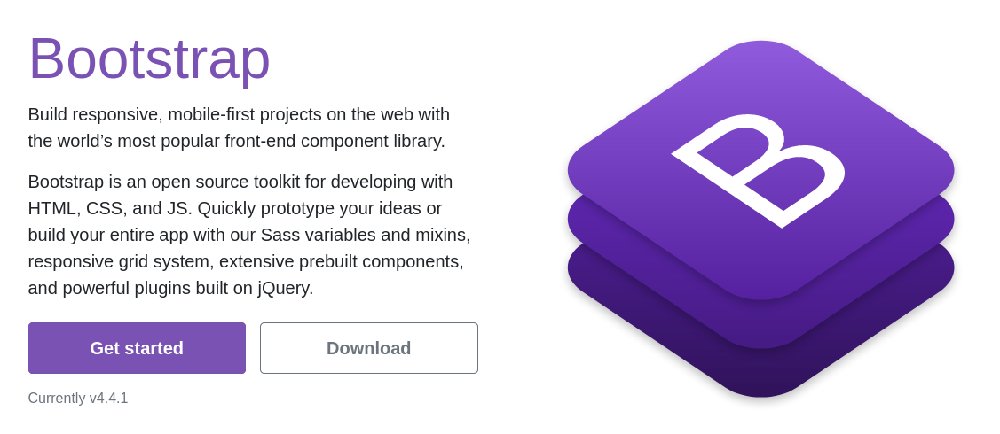
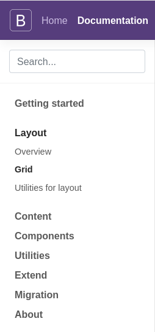
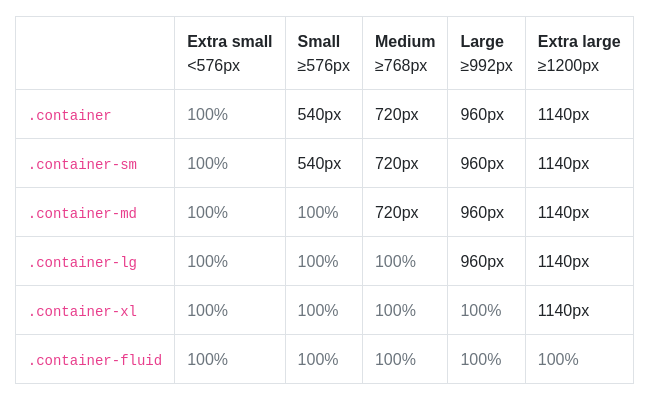

This lesson was based on the [Boostrap 4 Tutorial](https://www.w3schools.com/bootstrap4/default.asp) by W3C Schools


# CSS Frameworks

CSS Frameworks are like **packages of pre-build styling and components** that can be added to a website.

By copying the right syntax from the documentation these elements can be copy-pasted into a website.

This can make front-end development very fast.

<br>


<br>

> Using a framework is like linking an external CSS file to your HTML (similar to FontAwesome)
>
> You mostly add pre-defined classes to your HTML markup.
>
> **👉 It's all about reading the documentation.**

<br>

## Example: button styling

The default CSS button is know for not being particularly beautiful.

How long will it take you to create a more interesting button?

<iframe height="265" style="width: 100%;" scrolling="no" title="wk14 - bootstrap - button - ex_1" src="https://codepen.io/maujac/embed/VwvBrZo?height=265&theme-id=dark&default-tab=html,result" frameborder="no" allowtransparency="true" allowfullscreen="true">
  See the Pen <a href='https://codepen.io/maujac/pen/VwvBrZo'>wk14 - bootstrap - button - ex_1</a> by Mauricio Buschinelli
  (<a href='https://codepen.io/maujac'>@maujac</a>) on <a href='https://codepen.io'>CodePen</a>.
</iframe>

<br>

With a CSS Framework we can get a stylish button within a few seconds.

<br>

We will look at one particular CSS Framework: **Bootstrap**

There are many frameworks out there. Other popular options are **Materialize** by Google and **Foundation** by Zorg.

Bootstrap and Materialize work in a very similar way and differ mostly in their syntax.

<br>

# Bootstrap 4



<br>

Bootstrap was developed by [Twitter](https://en.wikipedia.org/wiki/Twitter) as a framework to encourage consistency across internal tools.

It is currently the most popular of all CSS frameworks.

<br>

## Getting started

In order to start using Bootstrap you have two options :

- **Download** a copy of all components, style sheets and scripts and host them in your website.

  - Provides most flexibility to trim-down and choose only what you need.
  - Create lighter and faster pages since visitors only download what they need.

  

- **Link** to packaged files via a CDN (content delivery network).

  - Fastest way to get started (no download or setup required).
  - Creates heavier websites since the user has to download the entire framework.

<br>

For simplicity we will use the CDN link option.

<br>

1. **Visit the official website and select get started .**

   

   In the Introduction page find the links to the BootstrapCDN. You need both the **CSS link and the JS link**.

   

   Note that it is possible to use only the CSS link if using styling only, however, dynamic components will not work.

   <br>

   

2. **Include the CSS link and the JS script in your HTML file.**

   

   **The CSS link** (as usual, include in the `<head>` of your html file):

   ```html
   <link rel="stylesheet" href="https://stackpath.bootstrapcdn.com/bootstrap/4.4.1/css/bootstrap.min.css" integrity="sha384-Vkoo8x4CGsO3+Hhxv8T/Q5PaXtkKtu6ug5TOeNV6gBiFeWPGFN9MuhOf23Q9Ifjh" crossorigin="anonymous">
   ```

   <br>

   **The JS script link** (as usual, include just before the end of your `</body>` tag):

   ```html
   <script src="https://code.jquery.com/jquery-3.4.1.slim.min.js" integrity="sha384-J6qa4849blE2+poT4WnyKhv5vZF5SrPo0iEjwBvKU7imGFAV0wwj1yYfoRSJoZ+n" crossorigin="anonymous"></script>
   <script src="https://cdn.jsdelivr.net/npm/popper.js@1.16.0/dist/umd/popper.min.js" integrity="sha384-Q6E9RHvbIyZFJoft+2mJbHaEWldlvI9IOYy5n3zV9zzTtmI3UksdQRVvoxMfooAo" crossorigin="anonymous"></script>
   <script src="https://stackpath.bootstrapcdn.com/bootstrap/4.4.1/js/bootstrap.min.js" integrity="sha384-wfSDF2E50Y2D1uUdj0O3uMBJnjuUD4Ih7YwaYd1iqfktj0Uod8GCExl3Og8ifwB6" crossorigin="anonymous"></script>
   ```

   <br>

   Note that Bootstrap has a dependency on **jQuery** and **Popper.js**, which are two JS frameworks. Therefore you also have to include them in your pages, and thus force your visitors to download them.

   <br>

3. **Understand how the docs are organized **

   

   At this point you are ready to start using Bootstrap.

   > You will need to consult the documentation a lot.
   >
   > **Become familiar with how it is organized.**

   <br>

   

<br>

**Take Bootstrap for a spin:**

1. In the documentation go to: *Components* > *Buttons* > *Outline buttons*

2. Copy the HTML code for all buttons in that section to the `<body>`  of your page.

3. Save and open it in the browser.


<br>

# Bootstrap Layout: Container & Grids

> Bootstrap uses a mobile-first flexbox grid for layouts
>
> **By default** all components are made to fit **mobile screens first.**

<br>

Bootstrap became popular before CSS Flexbox and CSS Grid. At the time, Bootstrap's grid system offered a mush easier alternative to creating responsive websites than using `tables` and `floats`.

- Nowadays the same can be achieved with CSS Flexbox and Grid.

<br>

**It is not necessary to use Bootstrap's container and grid system in order to use it's components.**

A few components expect the grid or container to be setup. See docs for details.

<br>

### Basic Structure

The following nesting structure is expected:


1. Everything exists inside a `.container`

2. A `.container` has one or multiple `.row` 

3. A `.row` has one or more `.col` (columns).

   <br>

We will look into each component.

   <br>


<p align="center"><a href="https://openclassrooms.com/en/courses/5664281-create-responsive-websites-efficiently-with-bootstrap-4/6446496-implement-your-page-structure"><em>Bootstrap Grid by openclassrooms.com</em></a></p>
<br>

## Containers

> This information is extracted from Bootstrap's [documentation: *Layout > Overview*](https://getbootstrap.com/docs/4.4/layout/overview/)

<br>

Containers are **required when using our default grid system**.

They are used in order to:

- contain
- pad
- center the content.


<br>

There are three different containers:

- `.container`, which sets a `max-width` at each responsive breakpoint
- `.container-fluid`, which is `width: 100%` at all breakpoints
- `.container-{breakpoint}`, which is `width: 100%` until the specified breakpoint

<br>

The use of `{breakpoint}`  above should be replaced by a **breakpoint code**.

Bootstrap's default breakpoints are:

<br>

**xs** = Extra small <576px

**sm** = Small ≥576px

**md** = Medium ≥768px

**lg** = Large ≥992px

**xl** = Extra large ≥1200px

<br>


<p align="center"><a href="https://bootstrapcreative.com/bootstrap-4-grid-explained-examples/"><em>Bootstrap native breakpoints by BootstrapCreative</em></a></p>
<br>

Based on these breakpoints, the size and padding of the  `.container` can be controlled.

The table below illustrates the size of a `.container` at a specific breakpoint:

<br>



<br>

See the containers in action and compare them with a [Grid example](https://getbootstrap.com/docs/4.4/examples/grid/#containers).

<br>

## Rows & Columns

Behind the scenes Bootstrap uses `Flexbox` to layout and align content.

- **Rows** are flex containers
  - Rows are added with the class of `.row`

- **Columns** are flex items
  - Columns are added with the class of `.col`

<br>

By default, space will be evenly distributed amongst the same columns in a row.

This is the equivalent of giving each flex item `flex: 1`.

<br>

<iframe height="313" style="width: 100%;" scrolling="no" title="wk14 - Bootstrap - grid - ex_1" src="https://codepen.io/maujac/embed/yLYErXL?height=313&theme-id=dark&default-tab=html,result" frameborder="no" allowtransparency="true" allowfullscreen="true">
  See the Pen <a href='https://codepen.io/maujac/pen/yLYErXL'>wk14 - Bootstrap - grid - ex_1</a> by Mauricio Buschinelli
  (<a href='https://codepen.io/maujac'>@maujac</a>) on <a href='https://codepen.io'>CodePen</a>.
</iframe>


<br>

## Grid: 12 columns

To control how much space each column will take in it's row Bootstrap uses a 12 grid system.

It is possible to specify how many columns a `.col` item will take by assigning it a number:

<br>


<p align="center"><a href="https://medium.com/gridbox/bootstrap-4-vs-foundation-6-grid-system-5874e0e87a95"><em>Bootstrap 4 Grid System by JR.Anand</em></a></p>
<br>

Using the number system above columns will always take the same amount of space in the grid.

<br>

## Responsive Grid

For responsive websites, it is possible to customize the size of your columns on different devices sizes.

Add the **breakpoint keyword** to the column class to specify how many columns it will take once the breakpoint is reached. 

<br>

The following will happen:

1. The column will start by taking 100% of the row.
2. Once the breakpoint is reached the column will listen to the number associated with the breakpoint.

<br>

<iframe height="228" style="width: 100%;" scrolling="no" title="wk14 - Bootstrap - responsive_grid - ex_2" src="https://codepen.io/maujac/embed/MWaXdmo?height=228&theme-id=dark&default-tab=html,result" frameborder="no" allowtransparency="true" allowfullscreen="true">
  See the Pen <a href='https://codepen.io/maujac/pen/MWaXdmo'>wk14 - Bootstrap - responsive_grid - ex_2</a> by Mauricio Buschinelli
  (<a href='https://codepen.io/maujac'>@maujac</a>) on <a href='https://codepen.io'>CodePen</a>.
</iframe>

<br>

Multiple breakpoint configurations can be added to the same column.

<br>

**📓 Now that you understand the basics of Bootstrap, you can learn the rest of the functionality from the documentation 📑**

<br>

# Bootstrap Content & Components

> For the remaining of the notes refer to the following sections of the documentation:
>
> - **Content**
>   - [Typography](https://getbootstrap.com/docs/4.4/content/typography/)
>   - [Images](https://getbootstrap.com/docs/4.4/content/images/)
> - **Utilities**
>   - [Colors](https://getbootstrap.com/docs/4.4/utilities/colors/)
>   - [Borders](https://getbootstrap.com/docs/4.4/utilities/borders/)
>   - [Spacing](https://getbootstrap.com/docs/4.4/utilities/spacing/)
> - **Components**
>   - [Buttons](https://getbootstrap.com/docs/4.4/components/buttons/)
>   - [Navbar](https://getbootstrap.com/docs/4.4/components/navbar/)
>   - [Cards](https://getbootstrap.com/docs/4.4/components/card/)