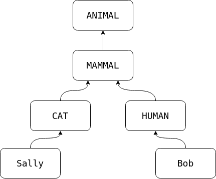
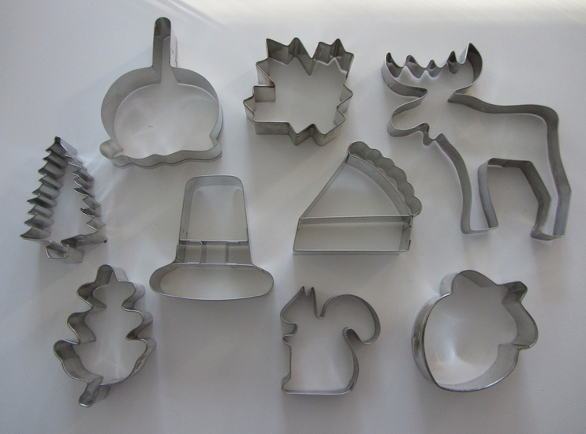
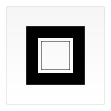
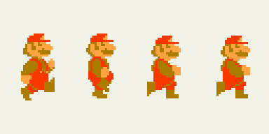

# Intro to JS OOP

JavaScript is an incredibly versatile language, which includes the ability to write Object Oriented Programming. 

Before 2015, objects in JavaScript were created without the use of Classes.

By default, objects inherit their properties and methods from other more "primitive" objects called prototypes.

The list of which prototype links to what prototype is called the prototype chain.

<br>





<br>

## Classes

In 2015 a new version of JavaScript was released named ES6 (ECMAScript 6).

ES6 included Classes, which provide an easier syntax to create and link Prototypes.

<br>

Classes can be used as templates to defining and creating objects.

<br>



<br>

Defining a class in JavaScript uses the following syntax:

```javascript
class Person {
    ...
}
```

<br>

A class needs a constructor function that will initialize the default properties of the class:

```javascript
class Person {
    constructor(name, surname) {
        this.firstName = name;		// Person has a property firstName
        this.lastName = surname;	// and a property lastName
    }
}
```

<br>

> The **this** keyword refers to the object being created, not to be confused with the Class
>
> (remember, the class is just a cookie cutter template).

<br>

The Person object is being initialized with two properties: `firstName` and `lastName`.

<br>

```javascript
{
    firstName: "...",
    lastName: "..."
}
```

Remember that the use of `{ }`  by themselves denotes an object in JavaScript.

<br>

This is best illustrated when an object is created based on the Class (referred to as an instance of the Class):

```javascript
let me = new Person(Mauricio, Buschinelli);
```

<br>

The arguments *Mauricio* and *Buschinelli* are passed directly to the constructor function.

Notice the **new** keyword. It indicated the creation of a new object from the Person Class.

<br>

When logging `me` :

```javascript
{
    firstName: "Mauricio",
    lastName: "Buschinelli"
}
```

<br>

## Class Methods

Classes can also contain methods:

```javascript
class Person {
    constructor(name, surname) {
        this.firstName = name;	
        this.lastName = surname;
    }
    
    greeting(){
        console.log('Hello!');
    }
}
```

<br>

Methods are defined just like functions, however, they don't need the **function** keyword.

<br>

Once the object is instantiated, the method would be called using the . (dot)  opertor:

```javascript
let me = new Person("Mauricio", "Buschinelli");

me.greeting();  // 'Hello!'
```

<br>

Methods can also refer to internal properties of the object by using the **this** keyword:

```javascript
class Person {
    constructor(name, surname) {
        this.firstName = name;
        this.lastName = surname;
    }
    
    greeting(){
        console.log('Hello!');
    }
    
    introduceMyself(){
        console.log('Hi, my name is ' + this.firstName)
    }
}
```


<br>

Then, once called:

```javascript
me.introduceMyself()  // Hi, my name is Mauricio
```

<br>

> The use of the **this** keyword only has meaning when used inside an object.
>
> **this** refers to the object that called the method.

<br>

## Objects as properties

Object properties can also be objects themselves (nested objects)

<br>

```javascript
class Person {
    constructor(name, surname, city, str) {
        this.firstName = name;
        this.lastName = surname;
        this.address = {			// property address points to an object
            city: city,
            street: str
        }
    }
    
    greeting(){
        console.log('Hello!');
    }
    
    introduceMyself(){
        console.log('Hi, my name is ' + this.firstName);
        console.log('I live in ' + this.address.city);		// access inside address
    }
}
```

<br>

Note that just like objects created without Classes, it is possible to add new properties "on the fly":

```javascript
me.address.number = 1234;
```

<br>

The object will now be:

```javascript
{
    address: {
        city: "Montreal",
        number: 1234,
        street: "Broadway"
    }
    firstName: "Mauricio",
	lastName: "Buschinelli"
}

```

<br>

# Intro to HTML &lt;canvas&gt;

These notes were made by Vikram Singh

<br>

## Getting Started

Canvas is an HTML element that we can use to dynamically create anything from simple graphics to fully interactive games on our webpage using JavaScript.

### Initialization

1. To declare a canvas element, simply put this into the `<body>` of your `index.html` file:

   - ```html
     <canvas></canvas>
     ```

   - This will create a canvas on the page with a default `width` of `300` and `height` of `150`.

     

2. Using CSS, give the `canvas` element a border.

   - This will make it easier to see in the browser.

     

3. In `main.js`, we need to get a handle on the canvas DOM element as well as get the canvas' context:

   - ```javascript
     const canvas = document.getElementsByTagName('canvas')[0];
     const context = canvas.getContext('2d');
     ```

   - The `context` is the object that contains all of the methods we need to create our drawings.

     <br>

### The canvas grid

Understanding how the canvas grid system works is crucial before we start drawing.

>  The origin (0, 0) of the grid starts in the top-left corner.
>
> Everything we draw is relative to the origin.

<br>


<br>

## 🔺 Drawing Shapes

We can draw *rectangles* and we can draw *paths*. A path can be thought of as a list of points that are connected by lines.

**Anything other than a rectangle must be created using a path.**

<br>

### Rectangles

 `x` and `y` specify the position on the canvas (relative to the origin) of the top-left corner of the rectangle. `width` and `height` provide the rectangle's size.


Each of these three functions takes the same parameters.

```javascript
fillRect(x, y, width, height); // Draws a filled rectangle.
strokeRect(x, y, width, height); // Draws a rectangular outline.
clearRect(x, y, width, height); // Clears the specified rectangular area.
```

<br>

For example:

```javascript
context.fillRect(25, 25, 100, 100);
context.clearRect(45, 45, 60, 60);
context.strokeRect(50, 50, 50, 50);
```

Renders this:



<br>

### Paths

When drawing shapes using paths, we must:

<br>

1. **Begin the path using `beginPath()`.**

   - Creates a new path. Once created, future drawing commands are directed into the path and used to build the path up. Internally, paths are stored as a list of sub-paths (lines, arcs, etc) which together form a shape. Every time this method is called, the list is reset and we can start drawing new shapes.

   

2. **Use various functions to define the path.**

   

3. **Close the path using `closePath()`.**

   - This method tries to close the shape by drawing a straight line from the current point to the start. If the shape has already been closed or there's only one point in the list, this function does nothing.
   - Note that the path, at this point, **is invisible**.

   

4. **Stroke or fill the path to render it onto the screen.**

<br>

For example, drawing a triangle would look something like this:

```javascript
const canvas = document.getElementById('canvas');
const context = canvas.getContext('2d');

context.beginPath();
context.moveTo(75, 50);
context.lineTo(100, 75);
context.lineTo(100, 25);
context.closePath();
context.fill();			// could also use stroke() to get only the lines.
```

<br>

### Arcs

To draw a circle, we must use the `arc` method:

```javascript
arc(x, y, radius, startAngle, endAngle, direction);
```

<br>

`x` and `y` are the coordinates of the center of the circle on which the arc should be drawn.

`radius` is self-explanatory.

The `startAngle` and `endAngle` parameters define the start and end points of the arc in **radians**, along the curve of the circle. These are measured from the x axis.

The `direction` parameter is a boolean value which, when true, draws the arc counter-clockwise; otherwise, the arc is drawn clockwise.

<br>

>**Note**: Angles in the `arc` function are measured in **radians, not degrees**. To convert degrees to radians you can use the following JavaScript expression: `radians = (Math.PI / 180) * degrees`.

<br>

## 🏃‍♀️ Animation

Animation is simply viewing a series of pictures one after the other in a small period of time. This creates the illusion that things are moving on the page.




<br>

To animate the canvas like a flipbook, the following must be done:

<br>

1. Draw a shape on the canvas.

2. Erase the shape from the canvas (or clear the entire drawing area).

3. Redraw that shape but in a slightly new position.

4. Repeat steps 1-3 ad infinitum.

   <br>

To create this animation loop, we'll use the following function:

```javascript
function animate() {
    requestAnimationFrame(animate);
   
    // Do steps 2 to 3 above ...
}
```

<br>

Anything in here now will be run over and over again. Therefore, we can do something like this:

```javascript
let xPos = 100;
let radius = 20;

function animate() {
    requestAnimationFrame(animate);
    context.clearRect(0, 0, canvas.width, canvas.height);

    context.beginPath();
    context.arc(xPos++, 100, radius, 0, 2 * Math.PI);
    context.closePath();
    context.stroke();
}

animate();
```

<br>

This will draw a circle on the screen, and on every frame, erase the canvas, and redraw the circle one pixel to the right of where it was before.

This creates an animation of a circle traveling towards to the right of the page.

<br>


# References

[**JavaScript Classes**](https://developer.mozilla.org/en-US/docs/Web/JavaScript/Reference/Classes) - MDN web docs

[**Class basic syntax**](https://javascript.info/class) - javascript.info

**[Canvas API](https://developer.mozilla.org/en-US/docs/Web/API/Canvas_API)** - MDN web docs

<br>

# Hands-on


## Lab 2 - Improving Person

Improve the Person class used in the notes by:

- Adding an age property.

- The age should be passed to the constructor, however, the constructor must make sure that the age is between 0 and 100.
- If the age is not valid (see above), then an age property should not be initialized.
- Modify introduceMyself() to also state the age of the person.

<br>

<iframe height="524" style="width: 100%;" scrolling="no" title="wk14 - JS_OOP - Lab 2" src="https://codepen.io/maujac/embed/jObvzvY?height=524&theme-id=dark&default-tab=js" frameborder="no" allowtransparency="true" allowfullscreen="true">
  See the Pen <a href='https://codepen.io/maujac/pen/jObvzvY'>wk14 - JS_OOP - Lab 2</a> by Mauricio Buschinelli
  (<a href='https://codepen.io/maujac'>@maujac</a>) on <a href='https://codepen.io'>CodePen</a>.
</iframe>


<br>

## Lab 3 - Animated Bubble

Try implementing a `Bubble` class that contains the properties and functionalities of a bubble object.

Here's a template to get you started:

```javascript
class Bubble {
    constructor(x, y) {
        /* Initialize the bubble's properties. */
    }

    draw() {
        /* Code concerning the drawing of the bubble should go here. */
    }

    update() {
        /* Code concerning the manipulation of the bubbles properties should go here. */
        this.draw();
    }
}

let bubble = new Bubble(100, 100);

function animate() {
    requestAnimationFrame(animate);
    context.clearRect(0, 0, canvas.width, canvas.height);

    bubble.update();
}
```

<br>

As for what the bubble should do, try implementing logic that:

1. When the bubble reaches the edges of the canvas, it changes direction (effectively bouncing from one side to another.)
2. Make the speed of the bubble adjustable via a variable.
