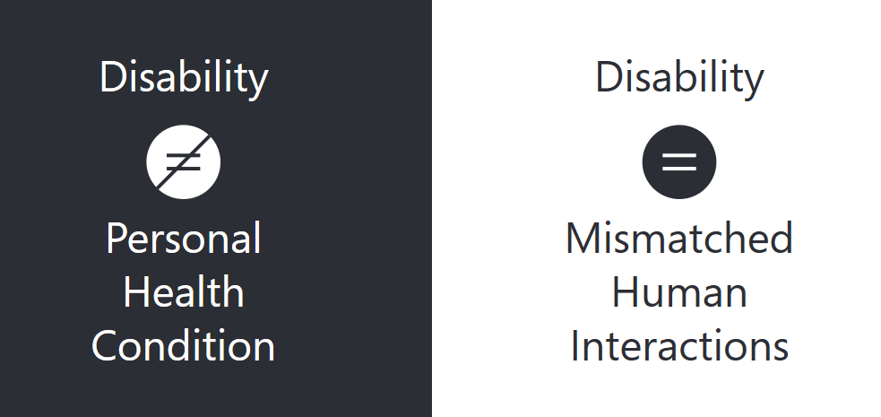
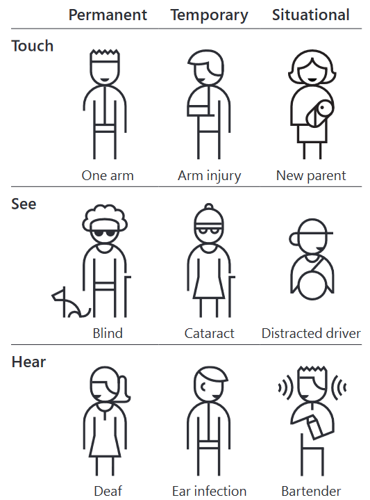
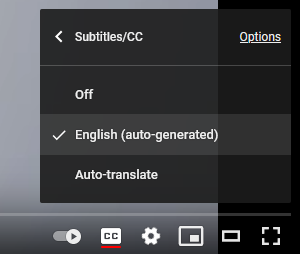

# Web Accessibility

Website design should include accessibility considerations from the very beginning of the project.

## What is web accessibility?

> Web accessibility is the practice of making your websites usable by as many people as possible.

Alternatively, you can think of web accessibility as **giving all users the same opportunity to consume and use your content**.

<br>

Certain design decisions can unintentionally make websites too difficult to navigate for some users in certain  contexts.

### Accessible design as a process

> It is impossible to make a site 100% accessible to 100% of users.
>
> **The focus is not perfection, but rather incremental but continuous improvement of your design practice and the accessibility of your sites.**


### Understanding Accessibility & Disability

There are a multitude of accessibility needs. 

> Roughly 15% of the World's population ([~1.3 billion people](https://www.worldbank.org/en/topic/disability)) require some degree of accessibility consideration.
>
> -[World report on disability](https://www.who.int/teams/noncommunicable-diseases/sensory-functions-disability-and-rehabilitation/world-report-on-disability), World Health Organization

<br>

#### Disability is context dependent

> Disability is not just a health problem. It is a complex phenomenon, reflecting the interaction between features of a person’s body and features of the society in which he or she lives.”
>
> –World Health Organization


In other words, disability happens when a specific interaction cannot accommodate a person's physical or cognitive condition.

<br>



<p align="center"><a href="https://download.microsoft.com/download/b/0/d/b0d4bf87-09ce-4417-8f28-d60703d672ed/inclusive_toolkit_manual_final.pdf"><em>Inclusive Design Toolkit, Microsoft Design</em></a></p>

<br>

#### Categories of disabilities

There are 3 types of disabilities that can affect web users:

1. **Permanent**
   - Ex.: Someone born blind or who suffered the loss of a limb.
2. **Temporary**
   - Ex.: Person who's recently done a cataract surgery or broke an arm.
3. **Situational**
   - Ex.: Distracted driver or a parent holding a baby.

<br>



<p align="center"><a href="https://download.microsoft.com/download/b/0/d/b0d4bf87-09ce-4417-8f28-d60703d672ed/inclusive_toolkit_manual_final.pdf"><em>Inclusive Design Toolkit, Microsoft Design</em></a></p>

<br>

##### Some permanent disabilities

- **Visual - **people with blindness, low-level vision, and color blindness.
- **Auditory -** people with low hearing levels or no hearing at all.
- **Motor/physical -** people with reduced mobility, weakness or loss of control in limbs.
- **Neuro-cognitive -** (very broad) people with dyslexia, attention deficit hyperactivity disorder, autism, etc. Can also include mental illnesses such as depression, schizophrenia and those who experience seizures.

<br>

## Solve for One, Extend to Many

There is a common misunderstanding that by adding accessibility features to a project, resources are being spent on a small segment of the userbase.

**In reality, accessibility benefits all users, not just those with disabilities.**

<br>


<br>

**Here are three examples:**

<br>

1. The OXO potato peeler was designed for a chef's wife that had arthritis. The wide handle design has become an industry standard.

   

   <p align="center"><a href="https://medium.com/valtech-design/inclusive-design-dd4e03f82094"><em>OXO Potato peeler</em></a></p>

   <br>

2. Predictive text was designed for users with reduced mobility and now everyone uses it for texting.

   <br>

   

   <p align="center"><a href="https://www.reddit.com/r/wholesomegifs/comments/6ew75u/my_phones_predictive_text_is_alright_xpost/"><em>Example of predictable texting in a smartphone</em></a></p>

   <br>

3. Automatic close captions were created to help people with auditory disabilities. Now many use it to watch videos in settings with high noise or use it as a tool to learn to read.

<br>



<br>

## The Six Basic Rules

> Web accessibility is a extensive topic, however, 90% of accessibility issues on websites can be solved with 5 basic design rules:

<br>

1. Use semantic elements such as `<nav>`, `<main>`, `<header>`, `<footer>`, etc.
2. Add `alt` attributes to images that describe the image in context.
3. Add properly associated labels to forms
4. Don't skip heading levels on a page.
5. Don't use poor contrasting colours - use a [contrast checker](https://webaim.org/resources/contrastchecker/)
6. Make large, clickable areas.

<br>

## Accessibility Audit Tools

There are Dev Tools that can scan your page and flag accessibility issues. 

These tools make it really easy to identify and fix simple and more design flaws. 

<br>

- [Free axe DevTools Browser Extension](https://www.deque.com/axe/browser-extensions/)

  - For Chrome, Firefox and Edge

    

- [tota11y visualization toolkit](https://khan.github.io/tota11y/) by Khan Academy

  - add the code below to the `<head>` of your HTML file and start using the audit tool

  ```js
  <script type="module">
    import khanacademyTota11y from 'https://cdn.skypack.dev/@khanacademy/tota11y';
  </script>
  ```

  

- [Accessibility Checklist](https://www.a11yproject.com/checklist/) by the a11y project 

  - Checklist for common web accessibility issues.

<br>

## References

This lesson was based on the following pages:

- [Inclusive design](https://medium.com/valtech-design/inclusive-design-dd4e03f82094), by Henry Neves-Charge
- [Inclusive Design Toolkit](https://download.microsoft.com/download/b/0/d/b0d4bf87-09ce-4417-8f28-d60703d672ed/inclusive_toolkit_manual_final.pdf), by Microsoft Design
- [Hacking Digital Styleguides for Accessibility: Type, Color, Imagery](https://www.skillshare.com/classes/Hacking-Digital-Styleguides-for-Accessibility-Type-Color-Imagery/1920202818/projects?via=watch-history) , by Tatiana Mac via SkillShare
- [W1y d2s a11y h2e to be so b4y c9d a1d i10e?](https://dev.to/inhuofficial/w1y-d2s-a11y-h2e-to-be-so-b4y-c9d-a1d-i10e-38no), by InHuOfficial


<br>

<!-- ## Hands-on

### Lab 1
 -->


