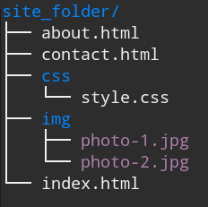

# Intro to CSS

**CSS**  (**C**ascading **S**tyle **S**heets) describes the visual styling of how HTML elements should be displayed.

- CSS was created to separate the responsibility of structuring the content from the responsibility of styling the content.
- The exact same HTML document can feel and look totally different thanks to CSS.

Here are two projects that illustrate the separation between CSS and HTML:

1. [One HTML Page - Multiple Styles!](https://www.w3schools.com/css/demo_default.htm) by W3School
2. [CSS Zen Garden](http://www.csszengarden.com/214/) by csszengarden.com


# CSS Syntax

Summarized from [CSS Syntax](https://www.w3schools.com/css/css_syntax.asp) by W3Schools:


<dl style="border: 1px solid gray; padding: 20px 20px 30px 20px; border-radius: 20px;
:">
    <dt><strong>Selector</strong></dt>
    <dd>determines which html element will be styled</dd>
    <br>
    <dt><strong>Declarations</strong></dt>
    <dd>A rule set of one or more <strong>property - value</strong> pairs, separated by a colon : </dd>
        <br>
    <dt><strong>Declaration block</strong></dt>
    <dd>Surrounds the declarations with curly braces { }</dd>
</dl>


<p align="center"><a href="https://www.w3schools.com/css/css_syntax.asp"><em>Hyperlink</em></a> <em>- CSS Syntax by W3Schools</em></p>
In the example below selects all `<p>` elements will be center-aligned, with a red text color:

```css
p {
  color: red;
  text-align: center;
}
```


## CSS Comments

Comments have a different styntax than HTML:

```css
 p {
  color: red;
  /* This is a single-line comment */
  text-align: center;
}

/* This is
a multi-line
comment */
```


# Implementing CSS with HTML

There are three different ways to use CSS with your HTML document:

1. Inline CSS
2. Internal CSS
3. External CSS


## Inline CSS

Add the `style=`  attribute **inside the html tag** followed by the CSS property and value:

*Code*

```html
<h3 style="color:red">Heading One</h3>
```

*Result*

<div style="background-color: rgb(248, 248, 246)">
    <h3 style="color:red">Heading Three</h3>
</div>


## Internal CSS

Add the CSS rules **in the head section of the html page** by adding a `<style>` section.

 ```html
<head>
    <meta charset="UTF-8">
    <title>Implementing Internal CSS</title>
	<style>
        h2 {
            color: green;
        }
	</style>
</head>
 ```


## External CSS

Use a separate CSS file (often a separate folder). **This is the preferred method out of the three **.





In the `<head>` of the html file include the `<link>` tag with the `ref="stylesheet"` attribute and value and within the same `<link>` tag add the `href="relative file path to css file"` attribute:

```html
<head>
	<link rel="stylesheet" href="./css/style.css">
</head>
```

With the rest of the HMTL document the external CSS declaration should look like:


```html
<!DOCTYPE html>
<html>
<head>
	<link rel="stylesheet" href="./css/styles.css">
</head>
    
<body>
	<!-- Website content -->
</body>
</html> 
```


# CSS Selectors


## Global Selectors

When using the html element tag as the selector **all elements of the same tag type will be affected**.

```html
<style>
	h2{
    	color:green;
	}
</style>
```

This will affect every `<h2>`  element in the page.


## Id Selectors

Target a specific HTML element by adding the `id="..."` attribute inside the opening html tag.

```html
<h2 id="unique-heading">Welcome</h2>
```

In the styling section reference the element's id with the `#` id selector:

```html
<style>
	#unique-heading {
    	color:green;
	}
</style>
```

**Element Id's should be unique.** It is standard practice to never give the same id to more than one element.


### Website Bookmarking with ID and Links

Use Id's to create bookmarks inside your website and use links `<a>` to jump to those Id's

Create a bookmark with the id attribute:


```html
<h2 id="references">Important References</h2>
```


Then, within the same page create a hyperlink that references the bookmark (note the use of `#` for ids):

```html
<a href="#references">Jump to Important References</a>
```


It's also possible to bookmark other pages within your website:

```html
<a href="./contact.html#contact">Jump to the Contact Page</a>
```


## Class Selectors

Classes are a styling template generally associated with more than one element.

Associate an html element to a class by adding the `class="..."` attribute inside the opening html tag.


```html
<h2 class="generic-heading">Contact</h2>
```


In the styling section reference the element's id with the `.` class selector:

```css
<style>
	.generic-heading {
    	color:red;
	}
</style>
```


## Multiple Selectors

If you would like to add the same styling to the multiple selectors, it is possible list multiple selectors at the same time:

```html
<style>
    #welcome, #about {
        border: 1px solid #ccc;
    }
</style>
```


## Nested selector

It is possible to target the inner elements of an element that has been given an id using a nested selector.

```html
<style>
    #welcome p {  /*  All the <p> elements inside the elements with id #welcome */
        font-size: 20px;
    }
</style>
```


**When using nested selections** remember that the property must be modified on the element that uses it, not on its parent. Therefore, **the last element to be called should be the element to be modified.**


## Select the entire page with the Body

In order to apply a styling to the whole page use the body selector:

```html
<style>
	body {
    	background-color:#333;
	}	
</style>
```


## Universal Selector

Use  `*`  to select every single element on document.

```css
* {
  text-align: center;
  color: blue;
}
```


# CSS Colors: text, background and borders

Refer to the [W3Schools page for CSS Color](https://www.w3schools.com/css/css_colors.asp) for this lesson.

We will cover:

- Color Names
- Background Color
- Text Color
- Border Color
- Color Values (name, hex, rgb, hsl, rgba, hsla)


# Resources & Looking Further

- [Inline, Internal, and External CSS in HTML](https://www.w3schools.com/html/html_css.asp)

- [CSS Syntax](https://www.w3schools.com/css/css_syntax.asp)

- [CSS Selectors](https://www.w3schools.com/css/css_selectors.asp)

- [HTML Id Attributes](https://www.w3schools.com/html/html_id.asp)


# Hands-on


## Exercises

Do the following exercises from W3Schools:

- [HTML Classes Exercise](https://www.w3schools.com/html/exercise.asp?filename=exercise_html_classes1)

- [HTML Id Exercise](https://www.w3schools.com/html/exercise.asp?filename=exercise_html_id1)

- [HTML CSS Exercise](https://www.w3schools.com/html/exercise.asp?filename=exercise_html_css1)

- [CSS Selectors Exercise](https://www.w3schools.com/css/exercise.asp?filename=exercise_selectors1)

- [CSS How To Exercise](https://www.w3schools.com/css/exercise.asp?filename=exercise_howto1)

- [CSS Dinner](https://flukeout.github.io/)


## Lab 1

Use CSS to style the provided html so that it looks like the image below.

**Requirements:**

1. Use an external CSS sheet.
2. Do minimal changes to the html file.


**[Download the initial html file here](https://drive.google.com/open?id=1sFctwIzPGUXpiXdWt0uygwHo2_hD3Mny).**


