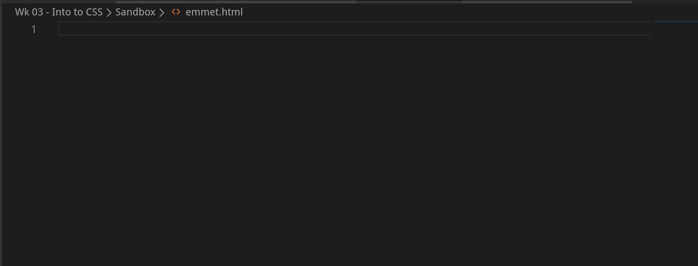
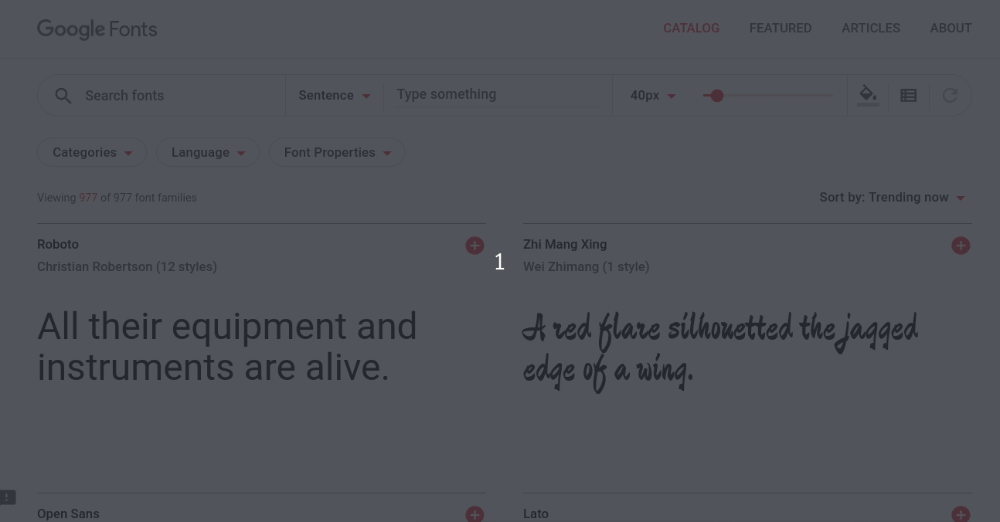
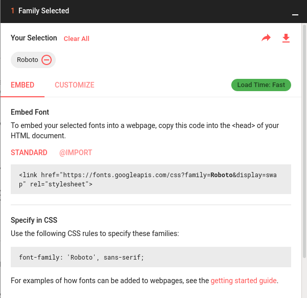

# Fonts

*This section was adapted from [CSS Fonts](https://www.w3schools.com/css/css_font.asp) by w3schools.com and [Fundamental text and font styling](https://developer.mozilla.org/en-US/docs/Learn/CSS/Styling_text/Fundamentals) by MDN Web Docs*.

# Font Types

In CSS, there are two types of font family names:

- **Generic family** - a group of font families with a  similar look (like "Serif" or "Sans Serif")
- **Font family** - a specific font family (like "Times New Roman"  or "Arial")


<br>


<p align="center"><a href="https://drmarkwomack.com/a-writing-handbook/style/typography/"><em>What Font Should I Use?</em></a></p>


# Changing fonts with `font-family:`

The fonts available to the browser depend largely on the fonts installed in the  operating system.

>  When selecting a font, make sure to include a series of fallback fonts, **from most specific to least specific**. 

This is also know as a font stack:

```html
p {
  font-family: "Times New Roman", Times, serif;
}
```
<br>

Here is a [list of fonts considered to be **Web Safe Fonts**](https://www.w3schools.com/cssref/css_websafe_fonts.asp), meaning you can count on them being available in most browsers.

> Font names composed of more than one word need to be written between quotations, such as "Times New Roman" above.


Fonts styles are normally applied to the entire page, do you can add them to the body selector:

```css
body {
	font-family: 'Segoe UI', Tahoma, Geneva, Verdana, sans-serif;
}
```

# Font size

Font size can be set with the `font-size` property.

`font-size` value can be set as absolute or relative:

**Absolute size:**

- Sets the text to a fixed side.
- User cannot adjust it (eg. increase font size in the browser).


**Relative size:**

- Size relative to another element in the page (see CSS Units below).
- User can adjust it.


## Recommendation & inheritance

> For `font-size` **it is recommended that you use relative CSS units over fixed units.**
>
> You need to be aware of where you HTML element is inheriting these units from

<br>
Two common relative units for `font-size` are:

**em:**

- 1 `em` is equal to the font size **set on the parent element of the current element** we are styling.
- Be be careful when styling nested elements.

**rem:**

- 1 `rem` is equal to the font size **set on the root element of the document** ( the `<html>`), not the parent element.


> It is recommended to use rem units for setting `font-size`
>
> The root `<html>` element has a default `font-size` of 16px (set in your browser settings).


*Code*

```css
h1 {
	font-size: 1.8rem;
}

.p1 {
	font-size: 1.2rem;
	color: red;
}
.p2 {
	font-size: 0.7rem;
	color: blue;
}
```

*Result*

<section style="background-color: rgb(248, 248, 246)">
    <h1 style="font-size:1.8rem;">Relative sizes</h1>
    <p style="font-size:1.2rem; color:red;">Lorem, ipsum dolor sit amet consectetur adipisicing elit.</p>
    <p style="font-size:0.7rem; color:blue;">Aliquam repellendus, debitis perspiciatis asperiores aut deleniti maxime totam neque dolores enim labore placeat facilis expedita iure!</p>
</section>


# CSS Units

!>  For this section we will refer to the page [CSS Units by W3Schools](https://www.w3schools.com/CSSref/css_units.asp).

## Responsive units

Use the `vw` unit to scale the `font-size` according to the browser's window size.

`vw` stands for "viewport width".

**Viewport stands for the size of your browser's window.**

<br>


<p align="center"><a href="https://www.kirupa.com/html5/viewport_device_document_size.htm"><em>Viewport, Device, and Document Size</em></a></p>

<br>

# VS Code Power-ups:

Now that you know what the viewport is you can unlock the `!` [Emmet](https://code.visualstudio.com/docs/editor/emmet) shortcut:




<br>

## Disabling Emmet

If you don't like Emmet's auto-complete, you can disable it:

1. File -> Preferences -> Settings
2. Search for Emmet
3. Disable settings as required (play around until you get the desirable behaviour)


# Meta Attributes: viewport & IE compatibility

If you use the `!` Emmet shortcut shown above you will notice it comes with two new `<meta>` attributes:

```html
<meta name="viewport" content="width=device-width, initial-scale=1.0">
```
and 

```html
<meta http-equiv="x-ua-compatible" content="ie=edge">
```


<br>

## Viewport device-width and initial-scale

The `<meta>` viewport element tells the browser how to control the page's dimensions and scaling.

The `width=` property controls the size of the viewport. It can be set to a specific number of pixels or to the device-width, which is the width of the screen at a scale of 100%.

The `initial-scale=` property controls the zoom level when the page is first loaded.

See [*Using the viewport meta tag to control layout on mobile browsers*](https://developer.mozilla.org/en-US/docs/Mozilla/Mobile/Viewport_meta_tag) for more info.


<br>

## IE compatibility mode

>When a browser encounters html code it cannot understand it will fallback to its "compatibility mode", where unexpected things might happen.

Internet Explorer (IE) supports the use of a document compatibility `<meta>` tag to specify what version of IE the page should be rendered as a fallback plan.

`content="ie=edge"` instructs IE to use the latest supported mode by using edge mode.

**Thanks to the recent obsolescence of Windows 7 (which shipped with old versions of IE) this compatibility meta tag will no longer be required.**

See this [Stack Overflow article](https://stackoverflow.com/questions/6771258/what-does-meta-http-equiv-x-ua-compatible-content-ie-edge-do) for more information.

<br>

# Using Web Fonts

You can include external fonts in your CSS.

A popular location to get external fonts is **Google Fonts:** https://fonts.google.com/



<br>



<br>

Include the provided link in the head section of your HTML file, just like you would link a CSS Style sheet.

```html
<link href="https://fonts.googleapis.com/css?family=Roboto&display=swap" rel="stylesheet"> 
```

<br>

Add the f`font-family` property in your CSS. **Don't forget to add a fall-back font**

```css
p {
	font-family: 'Roboto', sans-serif;
}
```


<br>

# Font Weight

The [`font-weight`](https://developer.mozilla.org/en-US/docs/Web/CSS/font-weight) property sets how bold the text is, depending on the values supported by the font family.

Common values are:

- `normal`, `bold`: Normal and **bold** font weight
- `lighter`, `bolder`: Relative values. Sets the element's boldness to be one step lighter or heavier than its parent element.
- `100`–`900`: Numeric boldness values that provide finer grained control than the above keywords.
  - `400` is equivalent to `normal`
  - `700` is equivalent to `bold`

See [font-weight by MDN](https://developer.mozilla.org/en-US/docs/Web/CSS/font-weight) web docs for more information 

```css
font-weight: bold;

font-weight: lighter;

font-weight: 200;
```

# Text Decorations

The [`text-decoration`](https://developer.mozilla.org/en-US/docs/Web/CSS/text-decoration) sets the decorations on fonts (mainly used to change default underline on links).

Common values are: 

- `none`: Unsets any text decorations already present.
- `underline`: <u>Underlines the text</u>.
- `line-through`: Puts a ~~strikethrough over the text~~.

# Text Layout & Alignment

!>  For this section we will refer to the **section "Text layout"** of the [Fundamental text and font styling](https://developer.mozilla.org/en-US/docs/Learn/CSS/Styling_text/Fundamentals#Text_layout) by MDN web docs.

<br>

Using the reference above, look at the following properties:

- [`text-align`](https://developer.mozilla.org/en-US/docs/Web/CSS/text-align) 
- [`line-height`](https://developer.mozilla.org/en-US/docs/Web/CSS/line-height)
- [`letter-spacing`](https://developer.mozilla.org/en-US/docs/Web/CSS/letter-spacing) 
- [`word-spacing`](https://developer.mozilla.org/en-US/docs/Web/CSS/word-spacing) 


## Which units: Em or Unitless ?

`line-height` defined in length or percentage units can have bad inheritance behaviour.

> Avoid unexpected results by using unitless line-height.

See [*Prefer unitless numbers for line-height values*](https://developer.mozilla.org/en-US/docs/Web/CSS/line-height) by MDN Web Docs for more info.


# Other text styling

There are many other text styling properties, some more used than others:

- [`font-style`](https://developer.mozilla.org/en-US/docs/Web/CSS/font-style): Used to turn italic text on and off. 
- [`text-transform`](https://developer.mozilla.org/en-US/docs/Web/CSS/text-transform): Transform you font to upper case, capitalised, full-width, etc.
- [`text-shadow`](https://developer.mozilla.org/en-US/docs/Web/CSS/text-shadow): Applies drop shadows to your text.

# Shorthand Properties Notation
You can set multiple font values in one shoot by using the shorthand `<font>` property (many CSS properties have a shorthand version):

> Refer to the MDN web doc page on the [**`<font>` property**](https://developer.mozilla.org/en-US/docs/Web/CSS/font)

In the example below the following font properties are set at the same time:

-  [`font-style`](https://developer.mozilla.org/en-US/docs/Web/CSS/font-style)
-  [`font-variant`](https://developer.mozilla.org/en-US/docs/Web/CSS/font-variant)
-  [`font-weight`](https://developer.mozilla.org/en-US/docs/Web/CSS/font-weight)
-  [`font-size`](https://developer.mozilla.org/en-US/docs/Web/CSS/font-size) / [`line-height`](https://developer.mozilla.org/en-US/docs/Web/CSS/line-height)
-    [`font-family`](https://developer.mozilla.org/en-US/docs/Web/CSS/font-family)


```css
body{
	font: italic small-caps bold 16px/2 cursive;    
}
```

## Font Shorthand Live Demo

This live demo illustrates how the `font` shorthand property affects a paragraph element.

[*This live demo is provided by MDN web docs*](https://developer.mozilla.org/en-US/docs/Web/CSS/font#frame_live_sample)

<div style="background-color: rgb(248, 248, 246)">
	<iframe class="live-sample-frame sample-code-frame" frameborder="0" height="450px" id="frame_live_sample" src="https://mdn.mozillademos.org/en-US/docs/Web/CSS/font$samples/live_sample?revision=1569828" width="100%"></iframe>
</div>


# Hands-on

## Exercises

Complete the following exercises from W3Schools:

1. [CSS Text](https://www.w3schools.com/css/exercise.asp?filename=exercise_text1)
2. [CSS Font](https://www.w3schools.com/css/exercise.asp?filename=exercise_font1)
