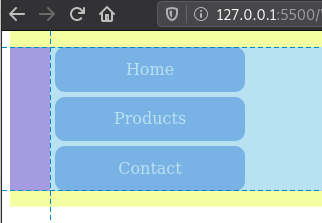
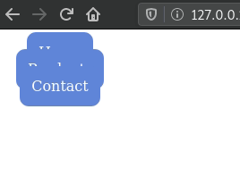
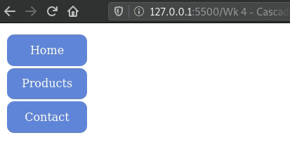
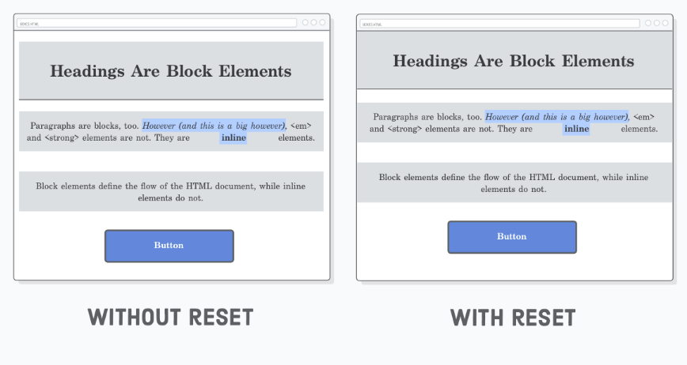
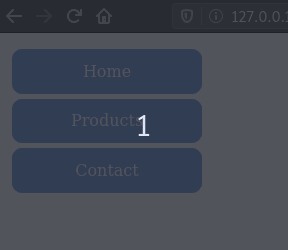

# 


# List Styles

!>  For this section we will refer to the page **[CSS Lists](https://www.w3schools.com/css/css_list.asp)** by W3Schools.

Using the reference above, look at the following CSS properties:

| Property                                                     | Description                                                  |
| ------------------------------------------------------------ | ------------------------------------------------------------ |
| [list-style ](https://www.w3schools.com/cssref/pr_list-style.asp) (shorthand) | Sets all the properties for a list in one declaration        |
| [list-style-image](https://www.w3schools.com/cssref/pr_list-style-image.asp) | Specifies an image as the list-item marker                   |
| [list-style-position](https://www.w3schools.com/cssref/pr_list-style-position.asp) | Specifies the position of the list-item markers (bullet points) |
| [list-style-type](https://www.w3schools.com/cssref/pr_list-style-type.asp) | Specifies the type of list-item marker                       |


## List Style Position

Note that the **default value** of `list-style-position` is `outside`.

This means two things:

-  the markers will fall **outside the list items but inside the list itself**
-  The **list items have a left padding** (empty space) by default.

<br>

When we add borders to the `<ul>` and the `<li>` elements we can "see" their default values:


*Code*:

```css
ul {
    border: solid 1px gray;
    width: 200px;
}
li {
    border:solid 1px blue;
}
```

*Result*:

<ul style="border:solid 1px gray; width:200px">
  <li style="border:solid 1px blue;">Coffee</li>
  <li style="border:solid 1px blue;">Tea</li>
  <li style="border:solid 1px blue;">Coca Cola</li>
</ul>

<br>

> If these default values are not desired (most cases), you must override them manually (see CSS Reset below).

<br>

# Lists & Navigation Bars

HTML List elements are used as navigation bars because they offer a range of semantic advantages:

- Hierarchy of links (specially for drop-down menus);
- `ul` lists can announce how many items it has;
- Tab order is built-in (particularly important for keyboard navigation).


> Its best practice to use list-items in a navigation bar by resetting default values.


If you would like to learn more about why we use lists, see this [Stackoverflow discussion on Why do navigation bars in HTML5 as lists?](https://stackoverflow.com/questions/36811224/why-do-navigation-bars-in-html5-as-lists)

<br>

**When creating your navigation bar from a list remember to:**

<br>

- Reset `text-decoration` on the `<a>` element and `list-style` on the `<li>` element;

  

  <br>

- Reset unwanted paddings and margins (specially the default left padding);

  

  <br>

- Add paddings on the `<a>` element (rather than the `<li>` element) so it has a clickable area;

  

<br>

- Set the `display`  property of the `<a>` element to `block` or `inline-block` (depending on who is setting the width).
  - Otherwise the default `inline` value will ignore any vertical paddings or margins.




<br>

- For horizontal alignment, setup the `display` property of the `<li>` to `inline-block`.
  - Otherwise, the `<li>` has a default behaviour of block-level, putting each item on a new line.
  - Note: it is possible to achieve a similar behaviour using floats but it is not recommended.



<br>

# CSS Reset

In order to avoid default spacing behaviours (`margin`, `padding`, and `box-sizing`) from causing unforseen situations, we can reset them.

> It is common practice to **reset** default spacing properties for all elements using the **universal CSS selector**.
>
> This is know as a **CSS Reset**.


```css
* {
  margin: 0;
  padding: 0;
  box-sizing: border-box;
}
```


The universal selector `*`  matchs every html element on the document. 

<br>

If we add the CSS Reset to the stylesheet of [the page we created in the previous section](../wk4/wk4_2_boxModel.md), it will cover the entire viewport (notice the margins of the `<body>` element):

 


# References & Diving Deeper

> Recommended reading: **[CSS Navigation Bar](https://www.w3schools.com/Css/css_navbar.asp)** by W3Schools


<br>

# Hands-on

## Lab 1

Create the vertical navigation menu below by using the provided html code and manipulating it's CSS properties.

**Requirements:**

- The colored part of the hyperlink should be "clickable" (the mouse cursor should change as soon as you hover it).


*HTML*

```html
<nav>
    <ul>
        <li><a href="#">Home</a></li>
        <li><a href="#">Products</a></li>
        <li><a href="#">Contact</a></li>
    </ul>
</nav>
```





### Lab 1 Solution

```css

*{
    box-sizing: border-box;
    margin:0;
    padding:0;
}
a{
    text-decoration: none;
    background-color: #5F85D8;
    color:white;
    padding:15px;
    display:inline-block;
    border-radius: 10px;
    width:150px;
    text-align: center;
    margin-top:10px;
    font-size:1.2rem;
}

```

<br>

## Lab 2

2. Transform the vertical navigation bar from the previous lab into a horizontal bar using the `display` property (see example below)


### Lab 2 Solution

```css
li{
    display:inline-block;
    margin:3px;
}
```


<br>

## Lab 3

Style the starting html code in order to create the 3 column section illustrated below:

```html
<body>
    <main>
        <section id="container">
            <h2>The 3 Column Container</h2>
            <article class="first">
                <h3>First box</h3>
            </article>
            <article class="second">
                <h3>Second box</h3>
            </article>
            <article class="third">
                <h3>Third box</h3>
            </article>
        </section>
    </main>
</body>
```


**Notes:**

- The width of the 3 collumns is set to a percentage of it's parent container.
- The odd "white-space" between the 3 collumns is quite "tricky" to eliminate. It will no longer be an issue once we start using Flexbox.


### Lab 3 Solution

```css
*{
    box-sizing: border-box;
    margin:0;
    padding:0;
}
h2{
    padding:1em;
    text-align: center;
}
article{
    display:inline-block;
    width:32%;
    text-align: center;

}
#container{
    border:10px solid #9ACD32;
    background-color: #6495ED;
}
h3{
    padding:25px;
}
.first{
background-color: #00FFFF;
}
.second{
background-color: #FFA07A;

}
.third{
background-color: #F5DEB3;
}

```


<!-- See the [**interactive video for step-by-step solution**](http://bit.ly/2IiYSUZ). -->

