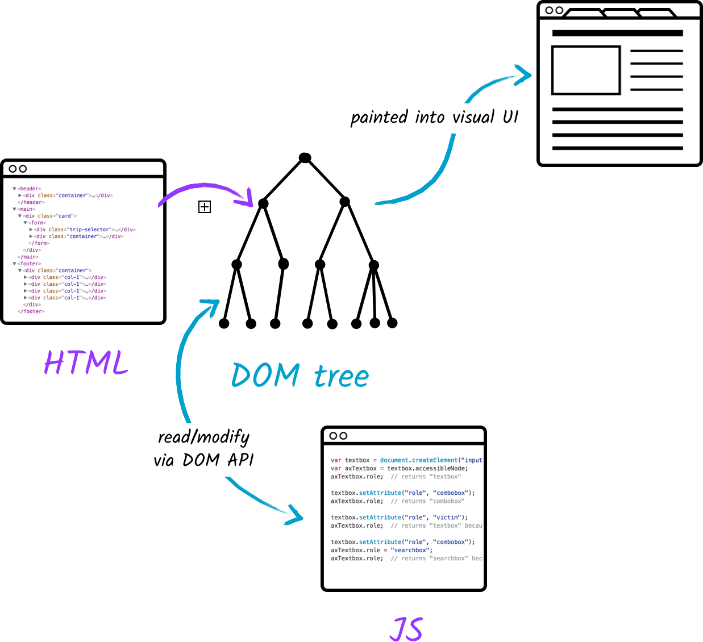

# Peaking into JavaScript

This module will try to briefly show how HTML, CSS and JavaScript interact together in the browser.

!> This module is purely for enjoyment and you will not be tested on this content until later in the course (around week 11).


## HTML and the DOM

Based on what we've learned so far, one might think that the browser reads the HTML we write and immediately renders it in the browser.

However, that is not a complete picture.

> The HTML is first converted into a heretical tree of elements (like a family tree) called the **Domain Object Model** or **DOM**.

The browser then reads from the DOM and finally renders elements in the screen.

<br>


<p align="center"><a href="https://www.kirupa.com/html5/finding_elements_dom_using_querySelector.htm"><em>The DOM Tree by Kirupa</em></a></p>

<br>

Once the HTML is used to create the DOM, it's job is done and it can no longer change it.

>  JavaScript can also create DOM elements, and unlike HTML, JavaScript can continuously add, remove and modify elements to the DOM. **It is dynamic.**

<br>

<p align="center"><a href="https://wicg.github.io/aom/explainer.html"><em>HTML and JavaScript interacting with the DOM by Web Incubator CG</em></em></a></p>

<br>


Dynamic content is great, but how do we make it happen?

<br>

## Running JavaScript

Similarly to CSS, there are a few different ways to link JavaScript code to our page.

### JS in a Separate File

The most common way is to **add JavaScript code in a separate file and then link it via a `<script> ` tag inside the `<head>`** of the HTML document (just like CSS).

<br>

***index.html***

```html
<head>
    <meta charset="UTF-8">
    <meta name="viewport" content="width=<device-width>, initial-scale=1.0">
    <title>Sample Site</title>
    <link rel="stylesheet" href="path/to/style.css">
    
    <script src="path/to/script.js" defer></script>		<!-- the 'defer' is important -->
    
</head>
```

<br>

Inside *script.js* you can start writing JavaScript directly:

***script.js***

```js
let message = "Executed from a separate file!"
alert(message)
```

<br>

### JS in the Dev Tools

When prototyping or debugging your code it is very common to inject JavaScript directly via the Dev Tools.

<br>


<br>

From the console, try adding the code snip from *script.js* to see it executed in any page.

<br>

## Selecting DOM elements

The DOM has an extensive API that exposes hundreds of methods and properties for selecting and manipulating elements.

<br>

Below are some of these methods:

| Method                                                       | Description                         |
| ------------------------------------------------------------ | ----------------------------------- |
| [document.getElementById(*id*)](https://www.w3schools.com/js/js_htmldom_elements.asp) | Find and return an element by id    |
| **Property**                                                 | **Description**                     |
| [*element*.innerHTML = *"new html content"*](https://www.w3schools.com/jsref/prop_html_innerhtml.asp) | Change the inner HTML of an element |
| [*element*.style.*property = "new style"*](https://www.w3schools.com/js/js_htmldom_css.asp) | Change the style of an HTML element |

<br>

Use the JS tab in the CodePen below to select and modify the content of the `<div>` with id of `second`.

<br>

```js
let my_element = document.getElementById("second")
my_element.innerHTML = "The new content";
```

<br>

Or better yet, made the element disappear from the DOM by setting the style properly `display: none`.

```js
let my_element = document.getElementById("second")
my_element.style.display = "none"
```

<br>

## DOM Events

An **event** is a signal that something has happened. Browsers are event based programs.

Every time your click on something, scroll the page or move the move an event is fired.

**Several events are fired by the browser every second.**


A few common events:

### **Mouse events:**

| Event name               | Description                                           |
| ------------------------ | ----------------------------------------------------- |
| `click`                  | When the mouse clicks on an element.                  |
| `mouseover` / `mouseout` | When the mouse cursor comes over / leaves an element. |
| `mousemove`              | When the mouse is moved.                              |

### **Keyboard events:**

| Event name | Description                        |
| ---------- | ---------------------------------- |
| `keydown`  | When the visitor presses the key.  |
| `keyup`    | When the visitor releases the key. |

<br>

### Event Handlers

We can write JavaScript code that is triggered when certain events happen. This is called an **event handler**.

There are multiple ways of using an event handler.

The easiest (and least recommended) is by **adding a handler as a HTML in-line attribute**.

<br>

A handler can be set in HTML with an attribute named  `on<event>`.

For example, using the `click` event:

<iframe height="265" style="width: 100%;" scrolling="no" title="wk7 - JS_Intro_onClick" src="https://codepen.io/maujac/embed/ZEBwXaM?height=265&theme-id=dark&default-tab=html,result" frameborder="no" loading="lazy" allowtransparency="true" allowfullscreen="true">
  See the Pen <a href='https://codepen.io/maujac/pen/ZEBwXaM'>wk7 - JS_Intro_onClick</a> by Mauricio Buschinelli
  (<a href='https://codepen.io/maujac'>@maujac</a>) on <a href='https://codepen.io'>CodePen</a>.
</iframe>

<br>

## Putting it Together