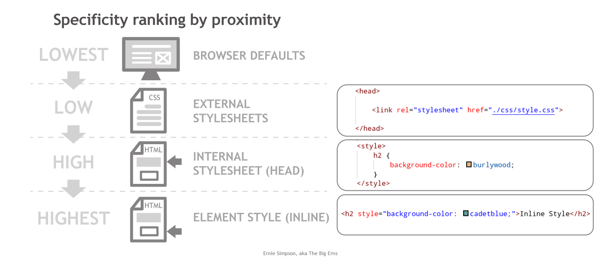

# The Cascade

The first "C" in CSS stands for Cascade, which is **the way how the browser will prioritise competing styles**.

<br>


There are four important concepts which are part of the Cascade:

<br>

<dl style="border: 1px solid gray; padding: 20px 20px 30px 20px; border-radius: 20px;
:">
    <dt><strong>Inheritance</strong></dt>
    <dd>Whether or not values are inherited from their parents.</dd>
    <br>
    <dt><strong>Source Origin</strong></dt>
    <dd><strong>Origin</strong>: where the rule was defined.</dd>
    <dd><strong>Order</strong>: the sequential order in which the style was positioned.</dd>
    <br>
    <dt><strong>Specificity</strong></dt>
    <dd>How specific a selector is.</dd>
    <br>
    <dt><strong>Importance</strong></dt>
    <dd>The type of style rule being applied (only mentiones here).</dd>
</dl>


## Inheritance

Depending on the element, some CSS properties are inherited from it's parent container and some set to it's default values.


For example, `color` and `font-family` are inherited from the parent element (except for certain browser defaults, like the `<a>` tag). The properties `width` and `border-radius` are not inherited.


> The best way to know whether or not a property will be inherited from it's parent is to fist check the documentation in W3Schools or MDN web docs and then verify it with the Dev Tools.


<br>

**[Check this list to see the default browser values of most elements.](https://www.w3schools.com/cssref/css_default_values.asp)**


It is possible to control an element's inheritance by using the following CSS values:

- `inherit`: use the same value as the parent.
- `initial`: use the default values set by the browser.
- `unset`: reset to it's original value (see table on link above).

<br>

As an example:

<iframe height="265" style="width: 100%;" scrolling="no" title="wk7 - Ex_Cascade_1" src="https://codepen.io/maujac/embed/wvapKxE?height=265&theme-id=dark&default-tab=html,result" frameborder="no" allowtransparency="true" allowfullscreen="true">
  See the Pen <a href='https://codepen.io/maujac/pen/wvapKxE'>wk7 - Ex_Cascade_1</a> by Mauricio Buschinelli
  (<a href='https://codepen.io/maujac'>@maujac</a>) on <a href='https://codepen.io'>CodePen</a>.
</iframe>


<br>

## Source Origin

The location and the order in which CSS properties are declared determine their priority.


### Origin Location

If there are conflicting CSS declarations, **the order of priority is as follows** (from least to most priority):

1. Browser Defaults (also called **user-agent**)
2. External Stylesheets
3. Internal Styles
4. Inline Styles

<br>



<p align="center"><a href="https://cssway.thebigerns.com/special/master-item-styles/"><em>The effect of Proximity on Specificity value in the Cascade Order</em></a></p>
<br>

### Order of declaration

The priority also depends on the order of declaration. **The last rule to be set wins**.

The order is determined using the conventional reading direction:

- Top to Bottom.
- Left to Right.

This priority order is applied for styles declared externally, internally or in-line.

<br>

Consider a HTML file linked to two css stylesheets that contain overlapping properties:

```html
<link rel="stylesheet" href="./css/first_styles.css">
<link rel="stylesheet" href="./css/second_styles.css">
```

The stylesheet declared last will have priority.

<br>

See other examples of priority by order of declaration:

<br>

<iframe height="265" style="width: 100%;" scrolling="no" title="wk7 - Ex_Cascade_3" src="https://codepen.io/maujac/embed/xxGpwBR?height=265&theme-id=dark&default-tab=html,result" frameborder="no" allowtransparency="true" allowfullscreen="true">
  See the Pen <a href='https://codepen.io/maujac/pen/xxGpwBR'>wk7 - Ex_Cascade_3</a> by Mauricio Buschinelli
  (<a href='https://codepen.io/maujac'>@maujac</a>) on <a href='https://codepen.io'>CodePen</a>.
</iframe>

<br>

Another example

<iframe height="265" style="width: 100%;" scrolling="no" title="wk7 - Ex_Cascade_2" src="https://codepen.io/maujac/embed/oNXpjmw?height=265&theme-id=dark&default-tab=css,result" frameborder="no" allowtransparency="true" allowfullscreen="true">
  See the Pen <a href='https://codepen.io/maujac/pen/oNXpjmw'>wk7 - Ex_Cascade_2</a> by Mauricio Buschinelli
  (<a href='https://codepen.io/maujac'>@maujac</a>) on <a href='https://codepen.io'>CodePen</a>.
</iframe>


<br>

## Specificity

Specificity determines which CSS rule is most specific to a particular element.


Every selector has its place in the specificity hierarchy. There are four  categories which define the specificity level of a selector (from lowest to highest):


1. **Elements and pseudo-elements**

   - This category includes element names and pseudo-elements.

   - Ex.: h1, div, :before and :after.

     

2. **Classes, attributes and pseudo-classes**

   - This category  includes .classes, [attributes] and pseudo-classes.

   - Ex.: .button, :hover, etc.

     

3. **IDs**

   - An ID is a unique identifier for the page elements.

   - Ex.: #navbar.

     

4. **Inline styles**

   - An inline style is attached directly to the element to be styled.

   - Ex.:  `<h1 style="color: #ffffff;">`.

<br>

> There is a formal way of determining the specificity of elements using a score system, from 1 to 1000, however, we will not cover it here.
>
> For more information see *[How to Calculate Specificity](https://www.w3schools.com/css/css_specificity.asp)* by W3Schools


<p align="center"><a href="https://docs.microsoft.com/en-us/dotnet/architecture/modern-web-apps-azure/common-client-side-web-technologies"><em>CSS Specificity rules, in order</em></a></p>
<br>


<p align="center"><a href="https://cssway.thebigerns.com/special/master-item-styles/"><em>Example of specificity ranking with regard to selector types</em></a></p>
<br>

An example of specificity:

<iframe height="265" style="width: 100%;" scrolling="no" title="wk7 - Ex_Cascade_4" src="https://codepen.io/maujac/embed/ZEGvQGQ?height=265&theme-id=dark&default-tab=css,result" frameborder="no" allowtransparency="true" allowfullscreen="true">
  See the Pen <a href='https://codepen.io/maujac/pen/ZEGvQGQ'>wk7 - Ex_Cascade_4</a> by Mauricio Buschinelli
  (<a href='https://codepen.io/maujac'>@maujac</a>) on <a href='https://codepen.io'>CodePen</a>.
</iframe>


<br>

## Importance

We will not cover importance in this course, howerver, it is helpful to be familiar the concept:

**There are 4 types of CSS rules which determine their importance** (from most to least important):

1. Transition
2. `!important` (property added to the end of a declaration)
3. Animation
4. Normal


# References & Diving Deeper

> Recommended reading: [**Cascade and inheritance**](https://developer.mozilla.org/en-US/docs/Learn/CSS/Building_blocks/Cascade_and_inheritance) page by MDN web docs.


Other resources:

- [The CSS Cascade](https://wattenberger.com/blog/css-cascade#specificity) by Amelia Wattanberger
- [The “C” in CSS: The Cascade](https://css-tricks.com/the-c-in-css-the-cascade/) by CSS-Tricks

  

# Hands-on

## Exercises

1. Do the *[Active learning: playing with the cascade](https://developer.mozilla.org/en-US/docs/Learn/CSS/Building_blocks/Cascade_tasks)* exercise from MDN Web docs.

   

2. Use the Cascade and create new css rules in order to overwrite (chage the styling) every rule at least once. You can add but you cannot modify the current code.

<br>

<iframe height="422" style="width: 100%;" scrolling="no" title="wk7 - Hands-on_1" src="https://codepen.io/maujac/embed/wvapMWZ?height=422&theme-id=dark&default-tab=html,result" frameborder="no" allowtransparency="true" allowfullscreen="true">
  See the Pen <a href='https://codepen.io/maujac/pen/wvapMWZ'>wk7 - Hands-on_1</a> by Mauricio Buschinelli
  (<a href='https://codepen.io/maujac'>@maujac</a>) on <a href='https://codepen.io'>CodePen</a>.
</iframe>


