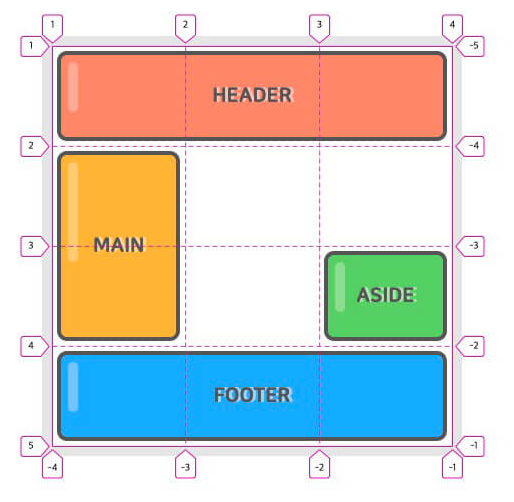
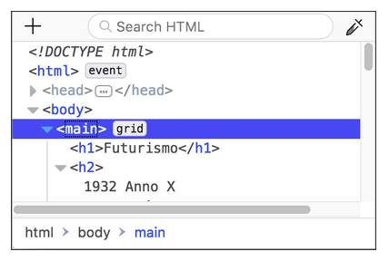
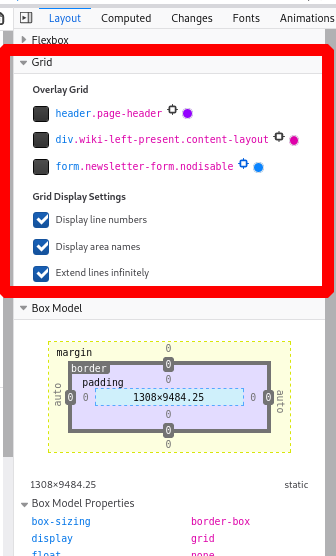
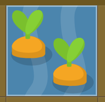

This lesson was based on the page **[Basic Concepts of grid layout](https://developer.mozilla.org/en-US/docs/Web/CSS/CSS_Grid_Layout/Basic_Concepts_of_Grid_Layout)** by MDN web docs, **[A Complete Guide to Grid](https://css-tricks.com/snippets/css/complete-guide-grid/)** by CSS Tricks and [**CSS Grid Layout Module**](https://www.w3schools.com/css/css_grid.asp) by W3Schools.


# Intro to CSS Grid

CSS Grid Layout is the most powerful layout system available in CSS. It is a 2-dimensional system, meaning it can handle both columns and rows.


<p align="center"><a href="https://seesparkbox.com/foundry/css_grid_layout_guide_with_flexbox_fallbacks"><em>Layout Perfection with CSS Grid and Flexbox Fallbacks</em></a></p>

<br>

# Grid Terminology


<p align="center"><a href="https://eastbaywp.com/2017/04/slides-flexbox-css-grid/"><em>Slides: Flexbox + CSS Grid: Magic for Responsive Layouts</em></a></p>


<br>

The basic Grid terminology includes:

<br>

**Grid Container** - The element on which `display: grid` is applied. It’s the direct parent of all the grid items. 

**Grid Item** - The children (i.e. *direct* descendants) of the grid container.

**Grid Line** - The dividing lines that make up the structure of the grid. They can  be either vertical or horizontal.

**Grid Track** - The space between two adjacent grid lines. You can think of them like the columns or rows of the grid.

**Grid Cell** - The space between two adjacent row and two adjacent column grid lines. It’s a single “unit” of the grid.

**Grid Area** - The total space surrounded by four grid lines. A grid area may be composed of any number of grid cells. 

<br>


<br>

# Why Grid when we have Flexbox?

**Grid enables 2 dimensional layouts without the need for several nested containers.**

It is important to note that Grid is not necessarily a replacement for Flexbox, but rather a complement. 

<br>


<p align="center"><a href="https://pogaltd.com/advancing-css-grid-two-dimensional-framework/"><em>Advancing to CSS Grid a Two Dimensional Framework</em></a></p>

<br>

How would you accomplish the layout on the right with Flexbox?


# Setting up the Grid

### Display: grid;

To create a Grid, use `display: grid;` on a parent container.


### Creating columns and rows;

To create columns and rows inside the grid:

Use `grid-template-columns` for the width of the columns;

Use `grid-template-rows` for the height of the rows;

<br>

Sizes of the grid columns and rows can be specified using:

- pixel `px` dimensions;
- auto for auto-sizing according to the content size;
- the fraction unit `fr` to distribute space in parts (similar to `flex: number` )


<br>

Consider the following HTML Code:

```html
<div class="wrapper">
  <div>One</div>
  <div>Two</div>
  <div>Three</div>
  <div>Four</div>
  <div>Five</div>
</div>
```


<br>

The CSS bellow will create three columns and two rows:

```css
.wrapper {
	display: grid;
	grid-template-columns: 200px 150px 200px;
    grid-template-rows: 100px 200px;
}
```


<br>

<iframe height="413" style="width: 100%;" scrolling="no" title="wk9_grid-col-row-ex4" src="https://codepen.io/maujac/embed/NWqZEON?height=413&theme-id=light&default-tab=result" frameborder="no" allowtransparency="true" allowfullscreen="true">
  See the Pen <a href='https://codepen.io/maujac/pen/NWqZEON'>wk9_grid-col-row-ex4</a> by Mauricio Buschinelli
  (<a href='https://codepen.io/maujac'>@maujac</a>) on <a href='https://codepen.io'>CodePen</a>.
</iframe>


<br>

<br>

Using the  `fr` unit it is possible to fill all the space with proportional spaces:


```css
.wrapper {
	display: grid;
	grid-template-columns: 1fr 2fr 1fr;
    grid-template-rows: 100px 200px;
}
```


<iframe height="420" style="width: 100%;" scrolling="no" title="wk9_grid-col-row-fr-ex5" src="https://codepen.io/maujac/embed/VwLJqyY?height=420&theme-id=light&default-tab=result" frameborder="no" allowtransparency="true" allowfullscreen="true">
  See the Pen <a href='https://codepen.io/maujac/pen/VwLJqyY'>wk9_grid-col-row-fr-ex5</a> by Mauricio Buschinelli
  (<a href='https://codepen.io/maujac'>@maujac</a>) on <a href='https://codepen.io'>CodePen</a>.
</iframe>


<br>

## The repeat() notation

To avoid repetition when listing the size and quantities of tracks, use the repeat notation:

**Syntax**

```css
repeat( <number of repetitions> , <pattern> );
```


<br>

**For example:**

`grid-template-columns: 1fr 1fr 1fr;`

is equivalent to:

`grid-template-columns: repeat(3, 1fr);`

<br>

The repeat() notation can be used to mix fixed and fraction units:

```css
.wrapper {
  display: grid;
  grid-template-columns: 100px repeat(3, 1fr) 100px;
}
```

<iframe height="232" style="width: 100%;" scrolling="no" title="wk9_grid-repeat-ex3" src="https://codepen.io/maujac/embed/ZEGdqrE?height=232&theme-id=light&default-tab=result" frameborder="no" allowtransparency="true" allowfullscreen="true">
  See the Pen <a href='https://codepen.io/maujac/pen/ZEGdqrE'>wk9_grid-repeat-ex3</a> by Mauricio Buschinelli
  (<a href='https://codepen.io/maujac'>@maujac</a>) on <a href='https://codepen.io'>CodePen</a>.
</iframe>


<br>

## The implicit and explicit Grid

In the example above, the **size of the columns was defined explicitly**, however, nothing was mentioned for the size of the rows.

Grid created it's own rows, which are part of the **implicit grid.** 


> Implicit tracks get created when there are more grid items than cells in the grid or when a grid item is placed outside of the explicit grid


<br>

You can also define a set size for **automatically created tracks** (created in the implicit grid) with the [`grid-auto-rows`](https://developer.mozilla.org/en-US/docs/Web/CSS/grid-auto-rows) and [`grid-auto-columns`](https://developer.mozilla.org/en-US/docs/Web/CSS/grid-auto-columns) properties.


<br>

In the example below, only the height of the first row was explicitly declared, all subsequent rows were created out of implicitly (out of necessity) and they took the value described by `grid-auto-rows: 120px`;


```css
.wrapper {
	display: grid;
	grid-template-columns: 1fr 2fr;
	grid-template-rows: 80px;
	grid-auto-rows: 120px;
}
```


<iframe height="443" style="width: 100%;" scrolling="no" title="wk9_grid-grid-auto-ex6" src="https://codepen.io/maujac/embed/zYGVyRe?height=443&theme-id=light&default-tab=result" frameborder="no" allowtransparency="true" allowfullscreen="true">
  See the Pen <a href='https://codepen.io/maujac/pen/zYGVyRe'>wk9_grid-grid-auto-ex6</a> by Mauricio Buschinelli
  (<a href='https://codepen.io/maujac'>@maujac</a>) on <a href='https://codepen.io'>CodePen</a>.
</iframe>


<br>

## Adjustable tracks with minmax( )

If you would like to give have explicit and implicit tracks a **minimum size but also allow them to expand** use the `minmax( )` property.

<br>

In the example below the rows will never collapse bellow 75 pixels, however they will stretch to accommodate for the content of the tallest cell.


```html
<div class="wrapper">
	<div>One</div>
    <div>Two
        <p>I have some more content in.</p>
        <p>This makes me taller than 75 pixels.</p>
    </div>
    <div>Three</div>
    <div>Four</div>
	<div>Five</div>
</div>
```


```css
.wrapper {
  display: grid;
  grid-template-columns: repeat(3, 1fr);
  grid-auto-rows: minmax(75px, auto);
}
```


<iframe height="374" style="width: 100%;" scrolling="no" title="wk9_grid-minmax-ex7" src="https://codepen.io/maujac/embed/NWqZezw?height=374&theme-id=light&default-tab=result" frameborder="no" allowtransparency="true" allowfullscreen="true">
  See the Pen <a href='https://codepen.io/maujac/pen/NWqZezw'>wk9_grid-minmax-ex7</a> by Mauricio Buschinelli
  (<a href='https://codepen.io/maujac'>@maujac</a>) on <a href='https://codepen.io'>CodePen</a>.
</iframe>


<br>

# Grid Lines

When the grid tracks are defined, **Grid automatically numbers the lines** between the tracks:


<p align="center"><a href="https://www.w3schools.com/css/css_grid.asp"><em>CSS Grid Layout Module</em></a></p>


<br>

Note that while **positive lines go from left to right**, there are also **negative line numbers that go from right to left**:




<p align="center"><a href="https://heropy.blog/2019/08/17/css-grid/"><em>CSS Grid 완벽 가이드</em></a></p>


<br>

## Placing items against Grid lines

It is possible to **control where the items sit on the grid according to grid line numbers**. 

- Empty spaces are allowed. 

- As you position some items, other items are laid out using auto placement rules.

<br>

Use the properties `grid-row` and `grid-column`to define the grid-item's starting and ending grid lines:

<br>

**Syntax:**

`grid-column: <starting-line-number> / <ending-linen-number> `

- The first value, `<starting-line-number>` , is where the grid item will start
- The second value, `<ending-linen-number>` , is where the grid will end.

<br>

<br>

```html
<div class="wrapper">
   <div class="box1">One</div>
   <div class="box2">Two</div>
   <div class="box3">Three</div>
   <div class="box4">Four</div>
</div>
```


```css
.wrapper {
   display: grid;
   grid-template-columns: repeat(3, 1fr);
   grid-template-rows: repeat(3, 100px);
}

.box1 {
   grid-column: 1 / 2;
   grid-row: 1 / 4;
}

.box2 {
   grid-column: 3 / 4;
   grid-row: 1 / 3;
}

.box3 {
   grid-column: 2 / 3;
   grid-row: 1 /  2;
}

.box4 {
   grid-column: 2 / 4;
   grid-row: 3 / 4;
}
```


<br>

<iframe height="419" style="width: 100%;" scrolling="no" title="wk9_grid-line_placement-ex8" src="https://codepen.io/maujac/embed/ExjBGMB?height=419&theme-id=light&default-tab=result" frameborder="no" allowtransparency="true" allowfullscreen="true">
  See the Pen <a href='https://codepen.io/maujac/pen/ExjBGMB'>wk9_grid-line_placement-ex8</a> by Mauricio Buschinelli
  (<a href='https://codepen.io/maujac'>@maujac</a>) on <a href='https://codepen.io'>CodePen</a>.
</iframe>

<br>

<br>


**Visualizing the line numbers might help understand how the items are being placed:**

<br>


<br>

Note that if only one value is given, the grid item will start at that line number.

```css
.box1 {
	grid-column: 3;   //The item will start at line 3.
}
```


<br>

> `grid-column: <value> / <value>` and `grid-row: <value> / <value>` are the shorthand notations for:
>
> - `grid-column-start: <value>`  and  `grid-column-end: <value>`;
> - `grid-row-start: <value>`  and  `grid-row-end: <value>`;

<br>

## The span keyword

You can specify a start line and then the number of tracks you would like the area to span.

<br>

Therefore, it is possible to replace the code below:

```css
.box1 {
   grid-column: 1 / 2;
   grid-row: 1 / 4;
}
```


**Using the span keyword:**


```css
.box1 {
    grid-column: 1;
    grid-row: 1 / span 3;
}
```


<br>


# Grid Gap (gutters)

Grid gaps are spaces between grid cells. They can be controlled with:

<br>

- [`column-gap`](https://developer.mozilla.org/en-US/docs/Web/CSS/column-gap) - for the space between the columns;
- [`row-gap`](https://developer.mozilla.org/en-US/docs/Web/CSS/row-gap) - for the space between the rows;
- the shorthand [`gap`](https://developer.mozilla.org/en-US/docs/Web/CSS/gap) 
  - if two values are provided: first value is row, second value is columns;
  - if a single value is provided, it is for both row and column.

<br>

Adding the following CSS to the example above gives the result below;

```css
.wrapper {
    gap: 0.5em 20px;
}
```


<iframe height="428" style="width: 100%;" scrolling="no" title="wk9_grid-gap-ex9" src="https://codepen.io/maujac/embed/JjdQxdY?height=428&theme-id=light&default-tab=result" frameborder="no" allowtransparency="true" allowfullscreen="true">
  See the Pen <a href='https://codepen.io/maujac/pen/JjdQxdY'>wk9_grid-gap-ex9</a> by Mauricio Buschinelli
  (<a href='https://codepen.io/maujac'>@maujac</a>) on <a href='https://codepen.io'>CodePen</a>.
</iframe>


# Grid Inspector: Dev Tools

With the growing layout complexity of CSS Grid, it becomes very important to see the Grid.

>  The Grid Inspector in the DevTools allows you to show the grid on a page, examine it and modify it.


<br>

**To enable the Grid Inspector follow these steps:**


1. In the **HTML pane** locate a Grid container identified with the `grid` keyword.

   <br>
   
   


<br>

2. In the **Layout pane**, expand the ***Grid* tab**:

   <br>

   

   <br>

   

3. Select the **Overlays you would like to visualise** as well as it's **display settings**

<br>


# Hands-on

1. Complete the [**Levels 1 to 15  and 20 to 28 of Grid Garden**](https://cssgridgarden.com/)





2. Visit both websites below and use the Gris Inspector in the Dev Tools to visualize their Grid System:
   - [**Futurismo**](http://labs.jensimmons.com/2016/examples/futurismo-1.html)
   -  [**Variations on a grid**](http://labs.jensimmons.com/2017/01-003.html) 
